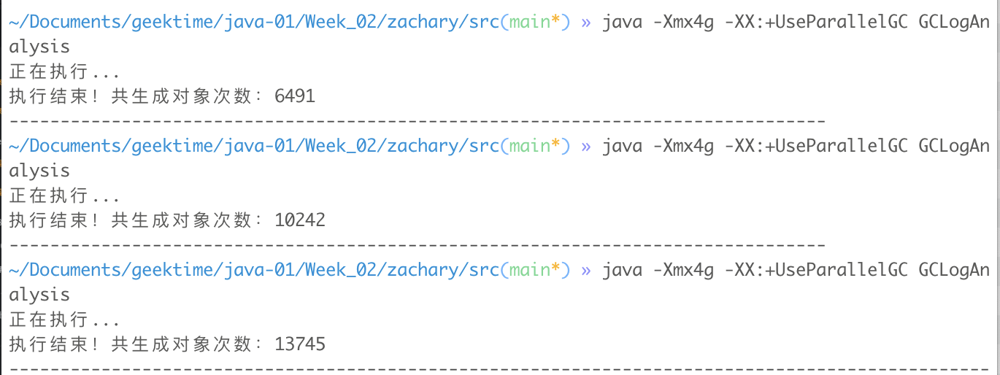
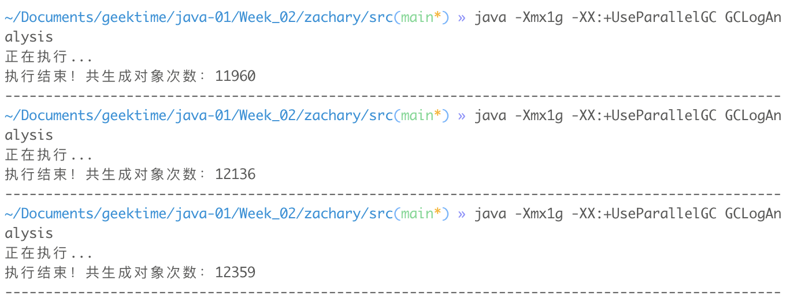

学习笔记

# JVM核心技术 -- 调优分析与面试经验

### 1. GC 日志解读与分析

- 不加任何参数时，执行程序

  - ```
    java GCLogAnalysis
    ```

  - 

- ```
  java -Xmx4g -XX:+UseParallelGC GCLogAnalysis
  ```

  - 

- ```
  java -Xmx2g -XX:+UseParallelGC GCLogAnalysis
  ```

  - 

- ```
  java -Xmx1g -XX:+UseParallelGC GCLogAnalysis
  ```

  - 

- ```
  java -Xmx512m -XX:+UseParallelGC GCLogAnalysis
  ```

  - 

- ```
  java -Xmx4g -Xms4g -XX:+UseParallelGC GCLogAnalysis
  ```

  - 

- ```
  java -Xmx2g -Xms2g -XX:+UseParallelGC GCLogAnalysis
  ```

  - 

- ```
  java -Xmx1g -Xms1g -XX:+UseParallelGC GCLogAnalysis
  ```

  - 

- ```
  java -Xmx512m -Xms512m -XX:+UseParallelGC GCLogAnalysis
  ```

  - 

- GC日志分析

  - 堆内存太小，会导致内存溢出

  - 堆内存太大，也可能会影响吞吐量，导致GC暂停时间较长

  - ```
    java -Xmx4g -Xms4g -XX:+PrintGCDetails -XX:+PrintGCDateStamps -XX:+UseParallelGC GCLogAnalysis
    正在执行...
    2021-01-21T16:20:12.252-0800: [GC (Allocation Failure) [PSYoungGen: 1048576K->174583K(1223168K)] 1048576K->236930K(4019712K), 0.3115472 secs] [Times: user=0.18 sys=0.52, real=0.31 secs]
    执行结束！共生成对象次数：3949
    Heap
     PSYoungGen      total 1223168K, used 206328K [0x000000076ab00000, 0x00000007c0000000, 0x00000007c0000000)
      eden space 1048576K, 3% used [0x000000076ab00000,0x000000076ca00220,0x00000007aab00000)
      from space 174592K, 99% used [0x00000007aab00000,0x00000007b557dfc0,0x00000007b5580000)
      to   space 174592K, 0% used [0x00000007b5580000,0x00000007b5580000,0x00000007c0000000)
     ParOldGen       total 2796544K, used 62346K [0x00000006c0000000, 0x000000076ab00000, 0x000000076ab00000)
      object space 2796544K, 2% used [0x00000006c0000000,0x00000006c3ce2aa8,0x000000076ab00000)
     Metaspace       used 2583K, capacity 4486K, committed 4864K, reserved 1056768K
      class space    used 279K, capacity 386K, committed 512K, reserved 1048576K
    ```

  - ```
    java -Xmx1g -Xms1g -XX:+PrintGCDetails -XX:+PrintGCDateStamps -XX:+UseParallelGC GCLogAnalysis
    正在执行...
    2021-01-21T16:25:38.059-0800: [GC (Allocation Failure) [PSYoungGen: 262144K->43505K(305664K)] 262144K->78380K(1005056K), 0.0701537 secs] [Times: user=0.05 sys=0.07, real=0.07 secs]
    2021-01-21T16:25:38.180-0800: [GC (Allocation Failure) [PSYoungGen: 305590K->43518K(305664K)] 340465K->150598K(1005056K), 0.0702225 secs] [Times: user=0.06 sys=0.11, real=0.07 secs]
    2021-01-21T16:25:38.292-0800: [GC (Allocation Failure) [PSYoungGen: 305662K->43518K(305664K)] 412742K->223885K(1005056K), 0.0330173 secs] [Times: user=0.07 sys=0.09, real=0.03 secs]
    2021-01-21T16:25:38.357-0800: [GC (Allocation Failure) [PSYoungGen: 305662K->43515K(305664K)] 486029K->301381K(1005056K), 0.0735044 secs] [Times: user=0.10 sys=0.10, real=0.08 secs]
    2021-01-21T16:25:38.525-0800: [GC (Allocation Failure) [PSYoungGen: 305659K->43518K(305664K)] 563525K->368636K(1005056K), 0.0315618 secs] [Times: user=0.06 sys=0.07, real=0.03 secs]
    2021-01-21T16:25:38.597-0800: [GC (Allocation Failure) [PSYoungGen: 305662K->43519K(160256K)] 630780K->443725K(859648K), 0.0654056 secs] [Times: user=0.07 sys=0.09, real=0.07 secs]
    2021-01-21T16:25:38.687-0800: [GC (Allocation Failure) [PSYoungGen: 160255K->71119K(232960K)] 560461K->477937K(932352K), 0.0181409 secs] [Times: user=0.04 sys=0.01, real=0.02 secs]
    2021-01-21T16:25:38.728-0800: [GC (Allocation Failure) [PSYoungGen: 187855K->91286K(232960K)] 594673K->510971K(932352K), 0.0176924 secs] [Times: user=0.06 sys=0.01, real=0.02 secs]
    2021-01-21T16:25:38.764-0800: [GC (Allocation Failure) [PSYoungGen: 207923K->109126K(232960K)] 627608K->544026K(932352K), 0.0180682 secs] [Times: user=0.06 sys=0.02, real=0.02 secs]
    2021-01-21T16:25:38.801-0800: [GC (Allocation Failure) [PSYoungGen: 225862K->81118K(232960K)] 660762K->575144K(932352K), 0.0313088 secs] [Times: user=0.06 sys=0.06, real=0.03 secs]
    2021-01-21T16:25:38.851-0800: [GC (Allocation Failure) [PSYoungGen: 197854K->41596K(232960K)] 691880K->608349K(932352K), 0.0371100 secs] [Times: user=0.07 sys=0.08, real=0.03 secs]
    执行结束！共生成对象次数：8195
    Heap
     PSYoungGen      total 232960K, used 46535K [0x00000007aab00000, 0x00000007c0000000, 0x00000007c0000000)
      eden space 116736K, 4% used [0x00000007aab00000,0x00000007aafd2d58,0x00000007b1d00000)
      from space 116224K, 35% used [0x00000007b1d00000,0x00000007b459f028,0x00000007b8e80000)
      to   space 116224K, 0% used [0x00000007b8e80000,0x00000007b8e80000,0x00000007c0000000)
     ParOldGen       total 699392K, used 566753K [0x0000000780000000, 0x00000007aab00000, 0x00000007aab00000)
      object space 699392K, 81% used [0x0000000780000000,0x00000007a2978568,0x00000007aab00000)
     Metaspace       used 2583K, capacity 4486K, committed 4864K, reserved 1056768K
      class space    used 279K, capacity 386K, committed 512K, reserved 1048576K
    ```

  - ```
    java -Xmx256m -Xms256m -XX:+PrintGCDetails -XX:+PrintGCDateStamps -XX:+UseParallelGC GCLogAnalysis
    正在执行...
    2021-01-21T16:25:59.496-0800: [GC (Allocation Failure) [PSYoungGen: 65536K->10748K(76288K)] 65536K->24762K(251392K), 0.0076839 secs] [Times: user=0.01 sys=0.03, real=0.01 secs]
    2021-01-21T16:25:59.515-0800: [GC (Allocation Failure) [PSYoungGen: 76227K->10751K(76288K)] 90241K->49488K(251392K), 0.0107661 secs] [Times: user=0.02 sys=0.04, real=0.01 secs]
    2021-01-21T16:25:59.536-0800: [GC (Allocation Failure) [PSYoungGen: 76112K->10749K(76288K)] 114848K->74465K(251392K), 0.0094921 secs] [Times: user=0.02 sys=0.03, real=0.01 secs]
    2021-01-21T16:25:59.555-0800: [GC (Allocation Failure) [PSYoungGen: 75850K->10748K(76288K)] 139566K->95178K(251392K), 0.0087431 secs] [Times: user=0.02 sys=0.03, real=0.01 secs]
    2021-01-21T16:25:59.573-0800: [GC (Allocation Failure) [PSYoungGen: 76284K->10736K(76288K)] 160714K->118067K(251392K), 0.0088806 secs] [Times: user=0.02 sys=0.03, real=0.01 secs]
    2021-01-21T16:25:59.592-0800: [GC (Allocation Failure) [PSYoungGen: 76272K->10731K(40448K)] 183603K->138678K(215552K), 0.0078229 secs] [Times: user=0.01 sys=0.03, real=0.01 secs]
    2021-01-21T16:25:59.604-0800: [GC (Allocation Failure) [PSYoungGen: 40379K->17466K(58368K)] 168325K->147909K(233472K), 0.0028246 secs] [Times: user=0.01 sys=0.00, real=0.00 secs]
    2021-01-21T16:25:59.611-0800: [GC (Allocation Failure) [PSYoungGen: 47162K->27245K(58368K)] 177605K->159670K(233472K), 0.0030520 secs] [Times: user=0.01 sys=0.00, real=0.00 secs]
    2021-01-21T16:25:59.618-0800: [GC (Allocation Failure) [PSYoungGen: 56926K->28663K(58368K)] 189352K->170839K(233472K), 0.0051624 secs] [Times: user=0.02 sys=0.01, real=0.01 secs]
    2021-01-21T16:25:59.628-0800: [GC (Allocation Failure) [PSYoungGen: 58158K->17463K(58368K)] 200335K->178156K(233472K), 0.0069866 secs] [Times: user=0.01 sys=0.03, real=0.01 secs]
    2021-01-21T16:25:59.635-0800: [Full GC (Ergonomics) [PSYoungGen: 17463K->0K(58368K)] [ParOldGen: 160693K->149147K(175104K)] 178156K->149147K(233472K), [Metaspace: 2577K->2577K(1056768K)], 0.0179833 secs] [Times: user=0.10 sys=0.00, real=0.02 secs]
    2021-01-21T16:25:59.659-0800: [Full GC (Ergonomics) [PSYoungGen: 29696K->0K(58368K)] [ParOldGen: 149147K->156860K(175104K)] 178843K->156860K(233472K), [Metaspace: 2577K->2577K(1056768K)], 0.0188793 secs] [Times: user=0.10 sys=0.00, real=0.02 secs]
    2021-01-21T16:25:59.683-0800: [Full GC (Ergonomics) [PSYoungGen: 29634K->0K(58368K)] [ParOldGen: 156860K->163648K(175104K)] 186494K->163648K(233472K), [Metaspace: 2577K->2577K(1056768K)], 0.0193807 secs] [Times: user=0.10 sys=0.01, real=0.02 secs]
    2021-01-21T16:25:59.707-0800: [Full GC (Ergonomics) [PSYoungGen: 29418K->0K(58368K)] [ParOldGen: 163648K->171493K(175104K)] 193066K->171493K(233472K), [Metaspace: 2577K->2577K(1056768K)], 0.0208422 secs] [Times: user=0.06 sys=0.01, real=0.02 secs]
    2021-01-21T16:25:59.734-0800: [Full GC (Ergonomics) [PSYoungGen: 29696K->0K(58368K)] [ParOldGen: 171493K->171745K(175104K)] 201189K->171745K(233472K), [Metaspace: 2577K->2577K(1056768K)], 0.0172587 secs] [Times: user=0.08 sys=0.00, real=0.02 secs]
    2021-01-21T16:25:59.756-0800: [Full GC (Ergonomics) [PSYoungGen: 29576K->2406K(58368K)] [ParOldGen: 171745K->174982K(175104K)] 201321K->177389K(233472K), [Metaspace: 2577K->2577K(1056768K)], 0.0208265 secs] [Times: user=0.08 sys=0.00, real=0.02 secs]
    2021-01-21T16:25:59.782-0800: [Full GC (Ergonomics) [PSYoungGen: 29670K->5564K(58368K)] [ParOldGen: 174982K->175039K(175104K)] 204653K->180604K(233472K), [Metaspace: 2577K->2577K(1056768K)], 0.0204468 secs] [Times: user=0.11 sys=0.01, real=0.02 secs]
    2021-01-21T16:25:59.807-0800: [Full GC (Ergonomics) [PSYoungGen: 29374K->6620K(58368K)] [ParOldGen: 175039K->174862K(175104K)] 204414K->181483K(233472K), [Metaspace: 2577K->2577K(1056768K)], 0.0211512 secs] [Times: user=0.09 sys=0.00, real=0.02 secs]
    2021-01-21T16:25:59.832-0800: [Full GC (Ergonomics) [PSYoungGen: 29672K->9429K(58368K)] [ParOldGen: 174862K->174918K(175104K)] 204535K->184348K(233472K), [Metaspace: 2577K->2577K(1056768K)], 0.0206041 secs] [Times: user=0.12 sys=0.00, real=0.02 secs]
    2021-01-21T16:25:59.857-0800: [Full GC (Ergonomics) [PSYoungGen: 29696K->13766K(58368K)] [ParOldGen: 174918K->174699K(175104K)] 204614K->188466K(233472K), [Metaspace: 2577K->2577K(1056768K)], 0.0225129 secs] [Times: user=0.09 sys=0.00, real=0.02 secs]
    2021-01-21T16:25:59.882-0800: [Full GC (Ergonomics) [PSYoungGen: 29298K->16967K(58368K)] [ParOldGen: 174699K->174583K(175104K)] 203998K->191551K(233472K), [Metaspace: 2577K->2577K(1056768K)], 0.0207755 secs] [Times: user=0.11 sys=0.00, real=0.02 secs]
    2021-01-21T16:25:59.905-0800: [Full GC (Ergonomics) [PSYoungGen: 29499K->17995K(58368K)] [ParOldGen: 174583K->174844K(175104K)] 204083K->192839K(233472K), [Metaspace: 2577K->2577K(1056768K)], 0.0249444 secs] [Times: user=0.09 sys=0.00, real=0.03 secs]
    2021-01-21T16:25:59.932-0800: [Full GC (Ergonomics) [PSYoungGen: 29595K->19685K(58368K)] [ParOldGen: 174844K->174874K(175104K)] 204440K->194559K(233472K), [Metaspace: 2577K->2577K(1056768K)], 0.0257973 secs] [Times: user=0.15 sys=0.00, real=0.02 secs]
    2021-01-21T16:25:59.959-0800: [Full GC (Ergonomics) [PSYoungGen: 29632K->22510K(58368K)] [ParOldGen: 174874K->174635K(175104K)] 204506K->197145K(233472K), [Metaspace: 2577K->2577K(1056768K)], 0.0179296 secs] [Times: user=0.08 sys=0.01, real=0.02 secs]
    2021-01-21T16:25:59.979-0800: [Full GC (Ergonomics) [PSYoungGen: 29638K->23015K(58368K)] [ParOldGen: 174635K->174246K(175104K)] 204273K->197262K(233472K), [Metaspace: 2577K->2577K(1056768K)], 0.0210060 secs] [Times: user=0.13 sys=0.00, real=0.03 secs]
    2021-01-21T16:26:00.001-0800: [Full GC (Ergonomics) [PSYoungGen: 29645K->22292K(58368K)] [ParOldGen: 174246K->174975K(175104K)] 203892K->197268K(233472K), [Metaspace: 2577K->2577K(1056768K)], 0.0251575 secs] [Times: user=0.13 sys=0.00, real=0.02 secs]
    2021-01-21T16:26:00.028-0800: [Full GC (Ergonomics) [PSYoungGen: 29420K->21812K(58368K)] [ParOldGen: 174975K->174705K(175104K)] 204396K->196517K(233472K), [Metaspace: 2577K->2577K(1056768K)], 0.0192595 secs] [Times: user=0.11 sys=0.00, real=0.02 secs]
    2021-01-21T16:26:00.049-0800: [Full GC (Ergonomics) [PSYoungGen: 29691K->21564K(58368K)] [ParOldGen: 174705K->174743K(175104K)] 204397K->196308K(233472K), [Metaspace: 2577K->2577K(1056768K)], 0.0222597 secs] [Times: user=0.13 sys=0.00, real=0.03 secs]
    2021-01-21T16:26:00.072-0800: [Full GC (Ergonomics) [PSYoungGen: 29131K->22845K(58368K)] [ParOldGen: 174743K->174947K(175104K)] 203875K->197792K(233472K), [Metaspace: 2577K->2577K(1056768K)], 0.0268188 secs] [Times: user=0.16 sys=0.00, real=0.02 secs]
    2021-01-21T16:26:00.100-0800: [Full GC (Ergonomics) [PSYoungGen: 29099K->24078K(58368K)] [ParOldGen: 174947K->174986K(175104K)] 204046K->199065K(233472K), [Metaspace: 2577K->2577K(1056768K)], 0.0263429 secs] [Times: user=0.16 sys=0.00, real=0.02 secs]
    2021-01-21T16:26:00.127-0800: [Full GC (Ergonomics) [PSYoungGen: 29490K->24263K(58368K)] [ParOldGen: 174986K->174851K(175104K)] 204477K->199115K(233472K), [Metaspace: 2577K->2577K(1056768K)], 0.0205137 secs] [Times: user=0.12 sys=0.01, real=0.02 secs]
    2021-01-21T16:26:00.149-0800: [Full GC (Ergonomics) [PSYoungGen: 29390K->25477K(58368K)] [ParOldGen: 174851K->175087K(175104K)] 204242K->200564K(233472K), [Metaspace: 2577K->2577K(1056768K)], 0.0238373 secs] [Times: user=0.14 sys=0.00, real=0.03 secs]
    2021-01-21T16:26:00.173-0800: [Full GC (Ergonomics) [PSYoungGen: 29571K->26379K(58368K)] [ParOldGen: 175087K->174388K(175104K)] 204658K->200767K(233472K), [Metaspace: 2577K->2577K(1056768K)], 0.0162818 secs] [Times: user=0.10 sys=0.00, real=0.02 secs]
    2021-01-21T16:26:00.190-0800: [Full GC (Ergonomics) [PSYoungGen: 29694K->27433K(58368K)] [ParOldGen: 174388K->174900K(175104K)] 204083K->202334K(233472K), [Metaspace: 2577K->2577K(1056768K)], 0.0187657 secs] [Times: user=0.11 sys=0.00, real=0.01 secs]
    2021-01-21T16:26:00.210-0800: [Full GC (Ergonomics) [PSYoungGen: 29447K->27499K(58368K)] [ParOldGen: 174900K->174940K(175104K)] 204347K->202439K(233472K), [Metaspace: 2577K->2577K(1056768K)], 0.0192417 secs] [Times: user=0.11 sys=0.00, real=0.01 secs]
    2021-01-21T16:26:00.229-0800: [Full GC (Ergonomics) [PSYoungGen: 29683K->27982K(58368K)] [ParOldGen: 174940K->174802K(175104K)] 204623K->202785K(233472K), [Metaspace: 2577K->2577K(1056768K)], 0.0100535 secs] [Times: user=0.06 sys=0.00, real=0.01 secs]
    2021-01-21T16:26:00.240-0800: [Full GC (Ergonomics) [PSYoungGen: 29647K->28178K(58368K)] [ParOldGen: 174802K->174668K(175104K)] 204450K->202846K(233472K), [Metaspace: 2577K->2577K(1056768K)], 0.0202036 secs] [Times: user=0.11 sys=0.00, real=0.02 secs]
    2021-01-21T16:26:00.261-0800: [Full GC (Ergonomics) [PSYoungGen: 29508K->28655K(58368K)] [ParOldGen: 174668K->174611K(175104K)] 204177K->203266K(233472K), [Metaspace: 2577K->2577K(1056768K)], 0.0055640 secs] [Times: user=0.02 sys=0.00, real=0.00 secs]
    2021-01-21T16:26:00.266-0800: [Full GC (Ergonomics) [PSYoungGen: 29411K->28850K(58368K)] [ParOldGen: 174611K->174557K(175104K)] 204023K->203408K(233472K), [Metaspace: 2577K->2577K(1056768K)], 0.0055446 secs] [Times: user=0.02 sys=0.00, real=0.01 secs]
    2021-01-21T16:26:00.272-0800: [Full GC (Ergonomics) [PSYoungGen: 29421K->28706K(58368K)] [ParOldGen: 174557K->174557K(175104K)] 203979K->203264K(233472K), [Metaspace: 2577K->2577K(1056768K)], 0.0034466 secs] [Times: user=0.01 sys=0.00, real=0.00 secs]
    2021-01-21T16:26:00.276-0800: [Full GC (Ergonomics) [PSYoungGen: 29696K->28721K(58368K)] [ParOldGen: 174557K->175077K(175104K)] 204253K->203799K(233472K), [Metaspace: 2577K->2577K(1056768K)], 0.0250709 secs] [Times: user=0.15 sys=0.01, real=0.03 secs]
    2021-01-21T16:26:00.301-0800: [Full GC (Ergonomics) [PSYoungGen: 29198K->28822K(58368K)] [ParOldGen: 175077K->175077K(175104K)] 204276K->203900K(233472K), [Metaspace: 2577K->2577K(1056768K)], 0.0039433 secs] [Times: user=0.02 sys=0.00, real=0.00 secs]
    2021-01-21T16:26:00.305-0800: [Full GC (Ergonomics) [PSYoungGen: 29384K->28822K(58368K)] [ParOldGen: 175077K->175077K(175104K)] 204462K->203900K(233472K), [Metaspace: 2577K->2577K(1056768K)], 0.0040863 secs] [Times: user=0.01 sys=0.00, real=0.00 secs]
    2021-01-21T16:26:00.310-0800: [Full GC (Ergonomics) [PSYoungGen: 29695K->29657K(58368K)] [ParOldGen: 175077K->174921K(175104K)] 204773K->204578K(233472K), [Metaspace: 2577K->2577K(1056768K)], 0.0173565 secs] [Times: user=0.10 sys=0.00, real=0.02 secs]
    2021-01-21T16:26:00.327-0800: [Full GC (Allocation Failure) [PSYoungGen: 29657K->29657K(58368K)] [ParOldGen: 174921K->174902K(175104K)] 204578K->204559K(233472K), [Metaspace: 2577K->2577K(1056768K)], 0.0210739 secs] [Times: user=0.12 sys=0.00, real=0.02 secs]
    Exception in thread "main" java.lang.OutOfMemoryError: Java heap space
    	at GCLogAnalysis.generateGarbage(GCLogAnalysis.java:43)
    	at GCLogAnalysis.main(GCLogAnalysis.java:21)
    Heap
     PSYoungGen      total 58368K, used 29696K [0x00000007bab00000, 0x00000007c0000000, 0x00000007c0000000)
      eden space 29696K, 100% used [0x00000007bab00000,0x00000007bc800000,0x00000007bc800000)
      from space 28672K, 0% used [0x00000007be400000,0x00000007be400000,0x00000007c0000000)
      to   space 28672K, 0% used [0x00000007bc800000,0x00000007bc800000,0x00000007be400000)
     ParOldGen       total 175104K, used 174902K [0x00000007b0000000, 0x00000007bab00000, 0x00000007bab00000)
      object space 175104K, 99% used [0x00000007b0000000,0x00000007baacd988,0x00000007bab00000)
     Metaspace       used 2607K, capacity 4486K, committed 4864K, reserved 1056768K
      class space    used 282K, capacity 386K, committed 512K, reserved 1048576K
    ```

- GC

  - Young GC、Full GC（Young GC + Old GC）
  - Minor GC（小型）、Major GC（大型）

- GCeasy - 分析GC文件、GC日志内容

### 2. JVM线程堆栈数据分析 

- jstack - fastThread分析工具

### 3. 内存分析与相关工具

- 对齐
- Instrumentation.getObjectSize()方法来估算一个对象占用的内存空间
- JOL可以用来查看对象
- 对象
  - 对象头
  - 对象体
- Integer = 3 * int
- Long = 2*long
- 多维数组：在二维数组int[dim1] [dim2]中，每个嵌套的数组int[ dim2 ]都是一个单独的Object，会额外占用16字节的空间。当数组维度更大时，这种开销特别明显。
- String：String对象的空间随着内部字符数组的增长而增长。当然，String累的对象有24个字节的额外开销。
- 对齐是绕不过去的问题，8的倍数
- Eclipse MAT
- Jhat

### 4. JVM问题分析与调优经验

- 高分配速率
  - 分配速率（Allocation rate）表示单位时间内分配的内存量。通常使用MB/sec作为单位。上一次垃圾收集之后，与下一次GC开始之前的年轻代使用量，两者的差值处以时间，就是分配速率
- 过早提升
  - 提神速率用于衡量单位时间内从年轻代提升到老年代的数据量。一般使用MB/sec作为单位，和分配速率类似
- Arthas

### 5. GC 疑难情况问题分析

### 6. JVM常见面试问题汇总

