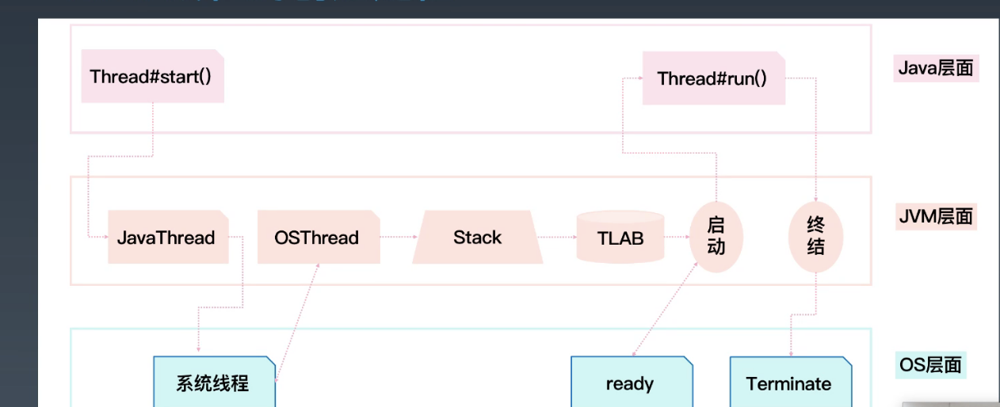

学习笔记

# Netty原理与API网关

### 1. 再谈谈什么是高性能 *

- 高并发用户 Concurrent Users
- 高吞吐量 Throughout
- 低延迟 Latency
  - 与响应时间的区别
    - 延迟一般指系统内，响应时间指请求开始到结束
  - 与吞吐量的关系
    - 延迟低的，吞吐量不一定高
- ～容量
- 高性能的另一面
  - 复杂度上升
  - 一旦出问题，严重程度会较高
- 应对策略
  - 稳定性建设（混沌工程）
- 从事件处理机制到Reactor模型
  - Reactor模式首先是事件驱动的，有一个或者多个并发输入源，有一个Service Handler和多个EventHandlers
    - 这个Service Handler会同步的将输入的请求多路复用的分发给相应的Event Handler
- 从Reactor模型到Netty NIO -- 01
  - 单线程
- 从Reactor模型到Netty NIO -- 02
  - 引入线程池
- 从Reactor模型到Netty NIO -- 03
  - bossGroup
  - subGroup
- 数据密集型应用系统设计 - DDA

### 2. Netty如何实现高性能 *

- Event & Handler
  - 入站事件
    - 通道激活和停用
    - 读操作事件
    - 异常事件
    - 用户事件
  - 出站事件
    - 打开连接
    - 关闭连接
    - 写入数据
    - 刷新数据
  - 事件处理程序接口
  - 适配器（空实现，需要继承使用）

### 3. Netty网络程序优化

- 粘包和拆包
  - ByteToMessageDecoder提供的一些常见的实现类：
    - FixedLengthFrameDecoder：定长协议解码器，可以指定固定的字节数算一个完整的报文
    - LineBasedFrameDecoder：行分隔符解码器，遇到\n或则会\r\n，则认为是一个完整的报文
    - DelimiterBasedFrameDecoder：分隔符解码器，分隔符可以自己指定
    - LengthFieldBasedFrameDecoder：长度编码解码器，将报文划分为报文头/报文体
    - JsonObjectDecoder：json格式解码器，当检测到匹配数量的“{"、"}"或"[""]"时，则认为是一个完整的json对象或者json数组

- Nagle与TCP_NODELAY
  - MTU - Maxitum Transmission Unit 最大传输单元
  - MSS - Maxitum Segment Size 最大分段大小，为MTU - 20（IP）- 20（TCP）
  - 优化条件
    - 缓冲区满
    - 达到超时
- 连接优化
  - 三次握手，四次挥手
    - 三次握手 - “ 你在不在？”，“我在，你在不在？”，“我在”
    - 四次挥手 - “分手吧”-客户端，“好” - 服务端，“确认分手了” - 服务端，“也好” - 客户端 
  - Linux上MSL默认1分钟
  - windows上默认为2分钟
  - 可以理解为先发起的一方为客户
- Netty优化
  - 不要阻塞EventLoop
  - 系统参数优化 -  MSL周期
    - Ulimit -a /proc/sys/net/ipv4/tcp_fin_timeout, TcpTimedWaitDelay
  - 缓冲区优化
    - So-revbuf / so_sndbuf /so_backlog / reusexxx
  - 心跳周期优化
    - 心跳机制与短线重连
  - 内存与ByteBuffer优化
    - DirectBuffer 与 HeapBuffer
  - 其他优化
    - ioRatio
    - Watermark
    - TrafficShaping

### 4. 典型应用：API网关

- 请求接入 - 作为所有API接口服务请求的接入点
- 业务聚合 - 作为所有后端业务服务的聚合点
- 中介策略 - 实现安全、验证、路由、过滤、流控等策略
- 统一管理 - 对所有API服务和策略进行统一管理
- 网关的分类
  - 流量网关
    - 稳定安全
  - 业务网关
    - 提供更好的服务
- Zuul 1
  - Zuul是NetFlix开源的API网关系统，它的主要设计目标是动态路由、监控、弹性和安全
  - Zuul的内部原理可以简单看作是很多不同功能filter的集合，最主要的就是pre、routing、post这三种过滤器，分别作用于调用业务服务API之前的请求处理、直接响应、调用业务服务API之后的响应处理。
- Zuul 2
  - 是基于Netty内核重构的版本
- 网关对比
  - 性能非常好，适合流量网关
    - openresty
    - kong
  - 扩展性好，适合业务网关，二次开发
    - spring cloud gateway
    - Zuul2

### 5. 自己动手实现APi网关 *

# Java 并发编程

### 1.多线程基础

- 多CPU核心意味着同时操作系统有更多的并行计算资源可以使用
- 操作系统以线程作为基本的调度单元
- 单线程是最好处理不过的
- 线程越多，管理复杂度越高
- 
- Java线程与底层操作系统线程之间适配和管理生命周期
- 查看线程
  - top 按 1
  - kill -3 发送信号3
- Java的线程是纯对象
  - 对应操作系统真实的线程是通过JVM虚拟机进行的 
- Daemon线程 - 精灵线程
  - 最后只有daemon线程的时候，主线程会直接退出

### 2.Java 多线程*

- 线程状态
  - start
  - runnable
  - running
  - interrupt
  - non-runnable
  - terminated
- Thread的状态改变操作
  - Thread.sleep(long millis) 一定是当前线程调用此方法，当前线程进入TIMED_WAITING状态，但不释放对象锁，millis后线程自动进入就绪状态。作用：给其他线程执行机会的最佳方式
  - Thread.yield()，一定是当前线程调用此方法，当前线程放弃获取的CPU时间片，但不释放锁资源，由运行状态变为就绪状态，让OS再次选择线程。作用：让相同优先级的线程轮流执行，但并不保证一定会轮流执行。实际中无法保证yield()达到让步目的，因为让步的线程还有可能被线程调度程序再次选中。Thread.yield()不会导致阻塞。该方法与sleep()类似，只是不能由用户指定暂停多长时间。
  - t.join/t.join(long millis) - 当前线程调用其他线程t的join方法，当前线程进入WAITING/TIMED_WAITING状态，当前线程不会释放已经持有的对象锁。线程t执行完毕或者millis时间到，当前线程进入就绪状态。
  - obj.wait()方法，当前线程调用对象的wait方法，当前线程释放对象锁，进入等待队列。依靠notify/notifyAll唤醒或者wait(long timeout) timeout时间到自动唤醒
  - Obj.notify唤醒在此对象监视器上等待的单个线程，选择是任意性的。notifyall唤醒在此对象监视器上等待的所有线程
- Thread的中断与异常处理
  - 线程内部自己处理异常，不溢出到外层
  - 如果线程被Object.wait、Thread.join和Thread.sleep三种方法之一阻塞，此时调用该线程的interrupt方法，那么该线程将抛出一个interruptedException中断异常（该线程必须事先预备好处理此异常），从而提早地终结被阻塞状态。如果线程没有被阻塞，这时调用interrupt将不起作用，直到执行到wait,sleep,join时，才马上会抛出intteruptedException

### 3.线程安全 *

- 多线程执行会遇到什么问题
  - 多个线程竞争同一资源时，如果对资源的访问顺序敏感，就称存在竞态条件，导致竞态条件发生的代码区称作临界区；不进行恰当的控制，会导致线程安全问题
- 并发相关的性质
  - 原子性：原子操作，对基本数据类型的变量的读取和赋值操作是原子性操作，即这些操作是不可被中断的，要么执行，要么不执行。
  - 执行语句
  - 可见性：对于可见性，Java提供了volatile关键字来保证可见性。
    - 当一个共享变量被volatile修饰时，它会保证修改的值会立即被更新到主存，当有其他线程需要读取时，它会去内存中读取新的值
    - 另外，通过synchronized和Lock也能够保证可见性，synchronized和Lock能保证同一时刻只有一个线程获取锁然后执行同步代码，并且在释放锁之前会将对变量的修改刷新到主存中
    - volatile并不能保证原子性
  - 有序性：Java允许编译器和处理器对指令进行重排序，但是重排序过程不会影响到单线程程序的执行，却会影响到多线程并发执行的正确性。可以通过volatile关键字类保证一定的“有序性”（synchronized 和Loak也可以）
  - happens-before原则
    - ～
  - synchronized的实现
    - 使用对象头标记字(Object monitor)
    - Synchronized优化
    - 偏向锁：BiaseLock
  - volatile
    - 每次读取都强制从主内存刷数据
    - 使用场景：单个线程写，多个线程读
    - 原则：能不用就不用，不确定的时候也不用
    - 替代方案：Atomic原子操作类

### 4.线程池原理与应用 *

- 线程池
  - Excutor - 执行者 - 顶层接口
    - excute - 没有返回值；异常可以在主线程中catch到
    - submit - 有返回值，用Future封装；捕捉不到异常
  - ExcutorService：接口API
  - ThreadFactory - 线程工厂
  - Excutors - 工具类，创建线程
- 线程池参数
  - ～
  - 拒绝策略
- 创建线程池的方法
  - ~
- 创建固定线程池的经验
  - 不是越大越好，大小肯定也不好
  - 假设核心数为N
    - 如果是CPU密集型应用，则线程池大小设置为N或N+1
    - 如果是IO密集型应用，则线程池大小设置为2N或2N+2
- Callable接口
  - Future

### 5.回顾与总结

