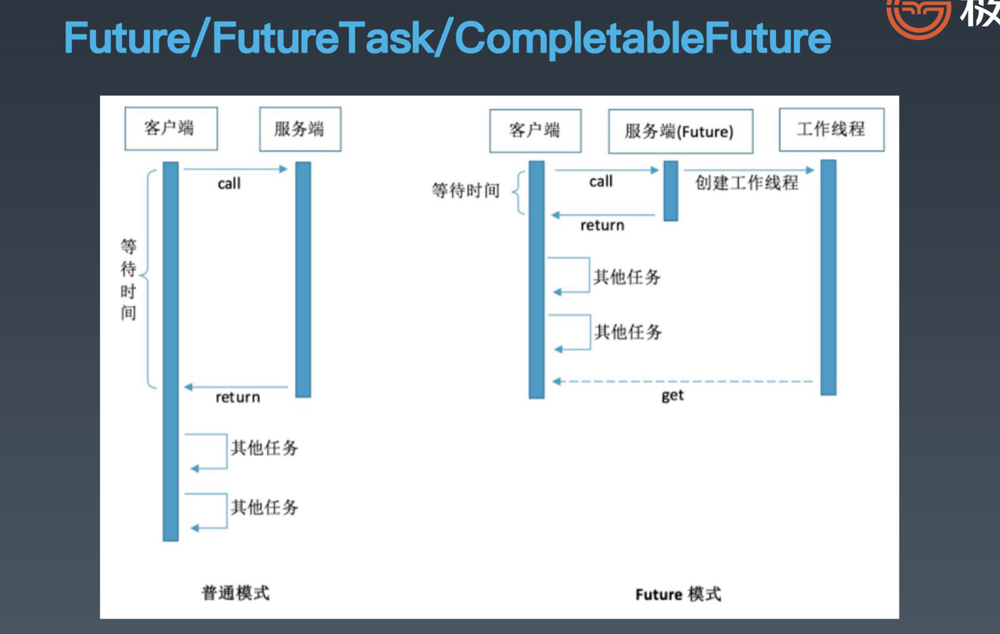

学习笔记

# Java并发编程 2

### 1.Java并发包

- JDK公开API，所有JDK都需要实现
  - 最基础，Integer/String
  - IO读写，文件操作
  - 工具类，集合/日期
  - 数学计算，BigInteger
  - 网络编程，Socket
  - Java内置的远程调用
  - JDBC操作数据库
- java扩展API，sun的JDK实现包
- Java.util.concurrency
  - 锁机制类Locks：Lock、Condition、ReentrantLock、ReadWriteLock、LockSupport
  - 原子操作类Atomic：AtomicInteger、AtomicLong、LongAdder
  - 线程池相关类Executor：Future、Callable、Executor、ExecutorService
  - 信号量三组工具类Tools：CountDownLatch、CyclicBarrier、Semaphore
  - 并发集合类Collections：CopyOnWriteArrayList、ConcurrentMap

### 2.到底什么是锁*

- 为什么需要显式的Lock

  - synchronized可以加锁
  - wait/notify可以看作加锁和解锁
  - 那为什么还需要一个显式的锁呢？
  - synchronized方式的问题
    - 同步块的阻塞无法中断（不能Interruptibly）
    - 同步块的阻塞无法控制超时（无法自动解锁）
    - 同步块无法异步处理锁（即不能立即知道是否可以拿到锁）
    - 同步块无法根据条件灵活的加锁解锁（即只能跟同步块范围一致）

- 更自由的锁：Lock

  - 使用方式灵活可控
  - 性能开销小
  - 锁工具包：java.util.concurrent.locks
  - Lock接口设计
    - 支持中断的API - void lockInterruptibly
    - 支持超时的PAI - boolean tryLock(long time, TimeUnit unit)
    - 支持非阻塞获取锁的API - boolean tryLock();

- 基础接口- Lock

  - | 重要方法                                                     | 说明                                                         |
    | ------------------------------------------------------------ | ------------------------------------------------------------ |
    | void lock();                                                 | 获取锁，类比synchronized(lock)                               |
    | void lockInterruptibly() throws InterruptedException         | 获取锁，允许打断                                             |
    | boolean tryLock(long time, TimeUnit unit) throws InterruptedException | 尝试获取锁；成功则返回true；超时则退出                       |
    | boolean tryLock();                                           | 尝试【无等待】获取锁；成功则返回true                         |
    | void unlock();                                               | 解锁；要求当前线程已获得锁；类比同步块结束                   |
    | Condition newCondition();                                    | 新增一个绑定到当前Lock的条件：示例：（类比：Object monitor）  final Lock lock = new ReentrantLock();final    Condition notFull = lock.newCondition();final Condition notEmpty = lock.newCondition(); |

  - 什么是可重入锁？

    - 第二次进入时是否阻塞

  - 什么是公平锁？

    - 公平锁意味着排队靠前的优先
    - 非公平锁则是都是同样机会

- 读写锁 - 接口与实现

  - | 重要方法         | 说明                           |
    | ---------------- | ------------------------------ |
    | Lock readLock()  | 获取读锁；共享锁               |
    | Lock writeLock() | 获取写锁；独占锁（也排斥读锁） |

  - 注意：ReadWriteLock管理一组锁，一个读锁，一个写锁。读锁可以在没有写锁的时候被多个线程同时持有，写锁是独占的。所有读写锁的实现必须确保写操作对读操作的内存影响。每次只能有一个写线程，但是同时可以有多个线程并发地读数据。ReadWriteLock适用于读多写少的并发情况。

- 基础接口 - Condition

  - | 重要方法                                                     | 说明                                             |
    | ------------------------------------------------------------ | ------------------------------------------------ |
    | Void await() throws InterruptedException                     | 等待信息；类比Object#wait()                      |
    | void awaitUninterruptibly()                                  | 等待信息；超时则返回false                        |
    | Boolean await(long time, TimeUnit unit) throws InterruptedException | 等待信号；超时则返回false                        |
    | Void signal()                                                | 给一个等待线程发送唤醒信号；类比Object#notify    |
    | void sigalAll()                                              | 给所有等待线程发送唤醒信号；类比Object#notifyAll |

  - 通过Lock.newCondition创建

  - 可以看作是Lock对象上的信号，类似于wait/notifyall

- LockSupport -- 锁当前线程

  - LockSupport类似于Thread类的静态方法，专门处理（执行这个代码的）本线程的
  - ？为什么unpark需要加一个线程作为参数？
    - 因为一个park的线程，无法自己唤醒自己，所以需要其他线程来唤醒

- 用锁的最佳实践

  - Doug Lea《Java并发编程：设计原则与模式》一书中，推荐的三个用锁的最佳实践，它们分别是：
    - 永远只在更新对象的成员变量时加锁
    - 永远只在访问可变的成员变量时加锁
    - 永远不在调用其他对象的方法时加锁
  - 总结 - 最小使用锁
    - 降低锁范围：锁定代码的范围/作用域
    - 细分锁粒度：将一个大锁，拆分成多个小锁

### 3.并发原子类*

- Atomic工具类
  - 原子类工具包 - java.util.concurrent.atomic
- 无锁技术 - Atomic工具类
  - 无锁技术的底层实现原理
    - Unsafe API - CompareAndSwap
    - CPU硬件指令支持 - CAS指令
    - value的可见性 - volatile关键字
- 锁与无锁之争
  - 到底是有锁好，还是无锁好？
    - CAS本质上没有使用锁
    - 并发压力跟锁性能的关系
      - 压力非常小，性能本身要求就不高
      - 压力一般的情况下，无锁更快，大部分都一次写入
      - 压力非常大，自旋导致重试过多，资源消耗很大。
- LongAdder对AtomicLong的改进
  - 分段思想
  - LongAdder的改进思路
    - AtomicInteger和AtomicLong里的value是所有线程竞争读写的热点资源
    - 将单个value拆分成跟线程一样多的数组Cell[]
    - 每个线程写自己的Cell[i]++，最后对数组求和

### 4.并发工具类详解

- 多个线程之间怎么相互协作？

  - 简单的协作机制
    - wait/notify
    - Lock/Condition
  - 更复杂的应用场景：
    - 需要控制实际并发访问资源的并发数量
    - 需要多个线程在某个时间同时开始运行
    - 需要指定数量线程到达某个状态再继续处理

- AQS 

  - AbstractQueuedSynchronnizer，即队列同步器。它是构建锁或者其他同步组件的基础（如Semaphore、CountDownLatch、ReentrantLock、ReentrantReadWriteLock），是JUC并发包中的核心基础组件，抽象了竞争的资源和线程队列。
  - AbstractQueuedSynchronizer：抽象队列式的同步器
  - 两种资源共享方式：独占｜共享，子类负责实现公平OR非公平

- Semaphore - 信号量

  - 准入数量N，N=1则等价于独占锁
  - 相当于synchronized的进化版
  - 使用场景 - 同一时间控制并发线程数

- CountdownLatch

  - | 重要方法                                   | 说明             |
    | ------------------------------------------ | ---------------- |
    | public CountDownLatch(int count)           | 构造方法（总数） |
    | void await() throws InterruptedException   | 等待数量归0      |
    | Boolean await(long timeout, TimeUnit unit) | 限时等待         |
    | void countDown()                           | 等待数减1        |
    | long getCount()                            | 返回剩余数量     |

  - 阻塞主线程，N个子线程满足条件时主线程继续

  - 场景：Master线程等待Worker线程把任务执行完

  - 示例：等所有人干完手上的活，一起去吃饭

- CyclicBarrier

  - | 重要方法                                                 | 说明                                       |
    | -------------------------------------------------------- | ------------------------------------------ |
    | public CyclicBarrie(int parties)                         | 构造方法（需要等待的数量）                 |
    | public CyclicBarrie(int parties, Runnable barrierAction) | 构造方法（需要等待的数量，需要执行的任务） |
    | int await()                                              | 任务内部使用；等待大家都到齐               |
    | int await(long timeout, TimeUnit unit)                   | 任务内部使用；限时等待到齐                 |
    | Void reset()                                             | 重新一轮                                   |

  - 场景：任务执行到一定阶段，等待其他任务对齐，阻塞N个线程时所有线程背唤醒继续

  - 示例：等待所有人都到达，再一起开吃。

- CountDownLatch与CyclicBarrier比较

  - | CountDownLatch                     | CyclicBarrier                             |
    | ---------------------------------- | ----------------------------------------- |
    | 在主线程里await阻塞并做聚合        | 直接在各个子线程里await阻塞，回调聚合     |
    | N个线程执行了countdown，主线程继续 | N个线程执行了await时，N个线程继续         |
    | 主线程里拿到同步点                 | 回调被最后到达同步点的线程执行            |
    | 基于AQS实现，state为count，递减到0 | 基于可重入锁condition.await/signalAll实现 |
    | 不可复用                           | 计数为0时重置为N，可以复用                |

- Future/FutureTask/CompletableFuture

  - 

- CompletableFuture

  - | 重要方法                                                     | 说明                       |
    | ------------------------------------------------------------ | -------------------------- |
    | static final boolean useCommonPool=(ForkJoinPool.getCommonPoolParallelism()>1); | 是否使用内置线程池         |
    | static final Executor asyncPool=useCommonPool?ForkJoinPool.commonPool():new ThreadPerTaskExecutor(); | 线程池                     |
    | CompletableFuture<Void>runAsync(Runnable runnable)           | 异步执行                   |
    | CompletableFuture<Void>runAsync(Runnable runnable, Executor executor) | 异步执行，使用自定义线程池 |
    | T get()                                                      | 异步执行，使用自定义线程池 |
    | T get(long timeout, TimeUnit unit)                           | 限时等待执行结果           |
    | T getNow(T valueIfAbsent)                                    | 立即获取结果（默认值）     |

# Java并发编程 3

### 1.常用线程安全类型 *

- JDK基础数据类型与集合类

  - ArrayList
    - 基本特点：基于数组，便于按index访问，超过数组需要扩容，扩容成本较高
    - 用途 ：大部分情况下操作一组数据都可以用ArrayList
    - 原理：使用数组模拟列表，默认大小10，扩容x1.5，newCapacity = oldCapacity + (oldCapacity >> 1)
    - 安全问题
      - 写冲突 - 两个写，相互操作冲突
      - 读写冲突 - 读，特别是iterator的时候，数据个数变了，拿到了非预期数据或者报错；产生ConcurrentModificationException
  - LinkedList
    - 基本特点：使用链表实现，无需扩容
    - 用途：不知道容量，插入变动多的情况
    - 原理：使用双向指针将所有节点连起来
  - List线程安全的简单方法
    - ArrayList的方法都加上synchronzied -> Vector
    - Collections.synchronizedList，强制将List的操作加上同步
    - Arrays.asList，不允许添加删除，但是可以set替换元素
    - Collections.unmodifiableList，不允许修改内容，包括添加删除和set
  - CopyOnWriteArrayList
    - 核心改进原理：
      - 写加锁，保证不会写混乱
      - 写在一个Copy副本上，而不是原始数据上（GC young区用复制，old区用本区内的移动）
    - 读写分离，最终一致
    - 插入元素时，在新副本操作，不影响旧引用 - 归并？
    - 删除元素时
      - 删除末尾元素，直接使用前N-1个元素创建一个新数组
      - 删除其他位置元素，创建新数组，将剩余元素复制到新数组
    - 读取不需要加锁 - 不改变内容，加锁反而影响性能
    - 使用迭代器的时候，直接拿当前的数组对象做一个快照，此后的List元素变动，就跟这次迭代没关系了。类似淘宝商品item的快照，商品价格会变，每次下单都会生成一个当时商品信息的快照。
  - HashMap
    - 基本特点：空间换时间，哈希冲突不大的情况下查找数据性能很高
    - 用途：存放指定key的对象，缓存对象
    - 原理：使用hash原理，存k-v数据，初始容量16，扩容x2，负载因子0.75
    - JDK8以后，在链表长度到8 &数组长度到64时，使用红黑树。
    - 安全问题
      - 写冲突
      - 读写问题，可能会死循环
      - keys()无序问题
  - LinkedHashMap
    - 基本特点：继承自HashMap，对Entry集合添加了一个双向链表
    - 用途：保证有序，特别是Java8 stream操作的toMap时使用
    - 同LinkedList，包括插入顺序和访问顺序
    - 安全问题：
      - 同HashMap
  - ConcurrentHashMap - Java7 与Java8 有区别
    - Java7 为实现并行访问，引入了Segment这一结构，实现了分段锁，理论上最大并发度与Segment个数相等。
    - Java8为进一步提高并发性，摒弃了分段锁的方案，而是直接使用一个大的数组

  

### 2.并发编程相关内容

- 线程安全操作利器 - ThreadLocal

  - | 重要方法                   | 说明                |
    | -------------------------- | ------------------- |
    | public ThreadLocal()       | 构造方法            |
    | Protected T initialValue() | 覆写-设置初始默认值 |
    | void set(T value)          | 设置本线程对应的值  |
    | void remove()              | 清理本线程对应的值  |
    | T get()                    | 获取本线程对应的值  |

  - 线程本地变量

  - 场景：每个线程一个副本

  - 不改方法签名静默传参

  - 及时进行清理

- 伪并发问题

  - 跟并发冲突问题类似的场景很多
  - 比如浏览器端，表单的重复提交问题
    - 客户端控制（调用方），点击后按钮不可用，跳转到其他页
    - 服务端控制（处理端），给每个表单生成一个编号，提交时判断重复

- 分布式下的锁和计数器

  - 分布式环境下，多个机器的操作，超出了线程的协作机制，一定是并行的
  - 例如某个任务只能由一个应用处理，部署了多个机器，怎么控制
  - 例如针对用户的限流是每分钟60次计数，API服务器有3台，用户可能随机访问到任何一台，怎么控制？（很想秒杀场景，库存固定且有限）

### 3.并发编程经验总结

- 加锁需要考虑的问题
  - 粒度
  - 性能
  - 重入
  - 公平
  - 自旋锁（spinglock）
  - 场景：脱离业务场景谈性能都是耍流氓
- 线程间协作与通信
  - 线程间共享：
    - static/实例变量（堆内存）
    - Lock
    - synchronized
  - 线程间协作
    - Thread#join()
    - Object#wait/notify/notifyAll
    - Future/Callable
    - CountdownLatch
    - CyclicBarrier

### 4.并发编程常见面试题 *

### 5.回顾与总结

