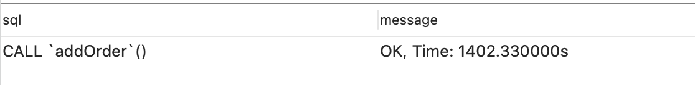

1. ～

2. 电商交易场景表结构，见e-commerce.sql文件

3. MySQL（在阿里云服务器上的搭建MySQL）的增删改查

4. MySQL插入100万条订单数据耗时1402.33s，使用的存储过程：

   ```sql
   CREATE DEFINER=`root`@`%` PROCEDURE `addOrder`( )
   BEGIN
     DECLARE var int;
   	DECLARE orderNo VARCHAR(255);
   	set var = 0;
   	while var < 1000000 do
   	set orderNo = CONCAT('OD',lpad(var, 10, '0'));
   	INSERT INTO `order` (order_no,user_id, product_id, total_price, num) values(orderNo,1,1,12.01, 1);
   	set var=var+1;
   	end while;
   END
   ```

   

