学习笔记

# 第15课 超越分库分表 - 数据库拆分与分库分表

### 1.为什么要做数据库拆分

- 从读写分离到数据库拆分
  - 主从结构解决了高可用，读扩展，但是单机容量不变，单机写性能无法解决
  - 提升容量-->分库分表，分布式，多个数据库，作为数据分片的集群提供服务
  - 降低单个节点的写压力
  - 提升整个系统的数据容量上限

### 2.数据库垂直拆分

- 垂直拆分 - 淘宝的服务化
  - 垂直分库分表=>分布式服务话=>微服务架构
- 拆库 
  - 将一个数据库，拆分成多个提供不同业务数据处理能里的数据库
- 拆表
  - 如果单表数据量过大，还可能需要对单表进行拆分
- 优点
  - 单库（单表）变小，便于管理和维护
  - 对性能和容量有提升作用
  - 改造后，系统和数据复杂度降低
  - 可以作为微服务改造的基础
- 缺点
  - 库变多，管理变复杂
  - 对业务系统有较强的侵入性
  - 改造过程复杂，容易出故障
  - 拆分到一定程度就无法继续拆分
- 垂直拆分的一般做法
  - 梳理清楚拆分范围和影响范围
  - 检查评估和重新影响到的服务
  - 准备新的数据库集群复制数据
  - 修改系统配置并发布新版上线
  - 注意：
    - 先拆分系统，还是先拆分数据库
    - 先拆分多大范围

### 3.数据库水平拆分

- 水平分库分表
- 分为，分库、分表、分库分表三类
- 有什么区别
- 数据库水平拆分
  - 水平拆分（按主键分库分表）：水平拆分就是直接对数据进行分片，有分库和分表两个具体方式，但是都只是降低单个节点数据量，但不改变数据本身的结构，这样对业务系统本身的代码逻辑来说，就不需要做特别大的改动，甚至可以基于一些中间件做到透明。
  - 水平拆分（按时间分库分表）：很多时候，数据是有时间属性的，所以自然可以按照时间维度来拆分。比如当前数据表和历史数据表，甚至按季度，按月，按天来划分不同的表。这样按照时间维度来查询数据时，就可以直接定位到当前的这个子表。
  - 问题：为什么有些DBA不建议分表，只建议分库？
- 分库还是分表，如何选择
  - 一般情况下，如果数据本身的读写压力较大，磁盘IO已经成为瓶颈，那么分库比分表要好。分库将数据分散到不同的数据库实例，使用不同的磁盘，从而可以并行提升整个集群的并行数据处理能力。相反的情况下，可以尽量多考虑分表，降低单表的数据量，从而减少单表操作的时间，同时也能在单个数据库上使用并行操作多个表来增加处理能力。
- 优点
  - 解决容量问题
  - 比垂直拆分对系统影响小
  - 部分提升性能和稳定性
- 缺点
  - 集群规模大，管理复杂
  - 复杂SQL支持问题（业务侵入性、性能）
  - 数据迁移问题
  - 一致性问题
- 数据库的分类管理
  - 通过分类处理提升数据管理能力
    - 随着对业务系统、数据本身的进一步了解，会发现很多数据对质量的要求是不同的。
    - 比如，订单数据，可能一直一致性要求最高，不能丢数据。而日志数据和一些计算的中间数据，我们则是可以不要那么高的一致性，丢了不要了，或者从别的地方找回来
    - 同样地，对于同样一张表里的订单数据，也可以采用不同策略，无效订单如果比较多，我们可以定期的清除或者转移（一些交易系统里有80%以上是机器下单然后取消的无意义订单，没有人会去查询它，所以可以清理）。
    - 如果无效订单，也可以考虑：
      - 最近一周下单但是未支付的订单，被查询和支付的可能性较大，再长时间的订单，可以直接取消掉。
      - 最近3个月下单的数据，被在线重复查询和系统统计的可能性最大
      - 超过3个月、3年以内的数据，查询的可能性非常小，可以不提供在线查询
      - 3年以上的数据，可以直接不提供任何方式的查询
    - 这样一来，就可以采取一定的手段去优化系统：
      - 定义一周内下单但未支付的数据为热数据，同时放到数据库和内存
      - 定义三个月内的数据为温数据，放到数据库，提供正常的查询操作
      - 定义3个月到3年的数据，为冷数据，从数据库删除，归档到一些便宜的磁盘，用压缩的方式（比如MySQL的tokuDB引擎，可以压缩到几十分之一）存储，用户需要邮件或者提交工单来查询，到处后发给用户
      - 定义3年以上的数据为冰数据，备份到磁带之类的介质上，不提供任何查询操作
    - 可以看到，这些都是针对一些具体场景，来分析和给出解决办法。那么通过在各种不同的场景下，都对现有的技术和手段进行一些补充，就会逐渐得到一个复杂的技术体系。

### 4.相关的框架和中间件

- Java框架层面
  - TDDL
  - Apache ShardingSphere - JDBC
- 中间件层面
  - DRDS（商业闭源）
  - Apache ShardingSphere-Proxy
  - MyCat/DBLE
  - Cobar
  - Vitness
  - KingShard
- 数据库中间件ShardingSphere
  - Apache ShardingSphere 是一套开源的分布式数据库中间件解决方案组成的生态圈，它由JDBC、Proxy和SideCar（规划中）这3款相互独立，却又能够混合部署配合使用的产品组成。它们均提供标准化的数据分片、分布式事务和数据库治理功能，可适用于如Java同构、异构语言、云原生等各种多样化的应用场景。
  - 框架ShardingSphere-JDBC直接在业务代码使用。支持常见的数据库和JDBC。Java Only。
  - 中间件ShardingSphere-Proxy作为中间件，独立部署，对业务端透明。目前支持MySQL和PostgreSQL。任何语言平台的系统都可以接入，可以使用mysql命令或者IDE操作。对业务系统侵入性小。

### 5.如何做数据迁移

- 数据迁移是重要的一环
  - 设计新系统容易，但是我们处理的都是老系统和历史诗句
  - 怎么能更平滑的迁移旧数据到新的数据库和系统
  - 特别是在异构的数据库结构情况下
  - 达到数据准确，迁移速度快，减少停机，对业务影响小。
- 数据迁移的方式：全量
  - 全量数据导出和导入
    - 业务系统停机
    - 数据库迁移，校验一致性
    - 然后业务系统升级，接入新数据库
  - 直接复制的话，可以dump后全量导入，如果是异构数据，需要用程序来处理
- 数据迁移的方式：全量+增量
  - 依赖于数据本身的时间戳
    - 先同步数据到最近的某个时间戳
    - 然后在发布升级时停机维护
    - 再同步最后一段时间（通常是一天）的变化数据
    - 最后升级业务系统，接入新数据库
- 数据迁移的方式：binlog+全量+增量
  - 通过主库或者从库的binlog来解析和重新构造数据，实现复制
  - 一般需要中间件等工具的支持
  - 可以实现多线程，断点续传，全量历史和增量数据同步
  - 继而可以做到：
    - 实现自定义复杂异构数据结构
    - 实现自动扩容和缩容，比如分库分表到单库单表，单库单表到分库分表，分4个库表到分64个库表。
- 数据库中间件ShardingSphere
  - 迁移工具ShardingSphere-scaling
    - 支持数据全量和增量同步
    - 支持断点续传和多线程数据同步
    - 支持数据库异构复制和动态扩容
    - 具有UI界面，可视化配置

### 6.总结

# 第16课 超越分库分表 - 分布式事务

### 1.分布式事务 *

- 为什么需要分布式事务
  - 业务系统的复杂度提升，数据量的增加，比如导致出现分布式事务。
  - 随着互联网、金融等行业的快速发展，业务越来越复杂，一个完整的业务往往需要调用多个子业务或服务，随着业务的不断增多，涉及的服务及数据也越来越多，越来越复杂。传统的系统难以支撑，出现了应用和数据库等的分布式系统。分布式系统又带来了数据一致性的问题，从而产生了分布式事务。
- 什么叫分布式事务
  - 分布式条件下，多个节点操作的整体事务一致性
  - 特别是在微服务场景下，业务A和业务B关联，事务A成功，事务B失败，由于跨系统，就会导致不被感知。此时从整体来看，数据是不一致的。
- 如何实现分布式下的一致性
  - 典型情况下是两个思路：
    - 理想状态：直接像单机数据库事务一样，多个数据库自动通过某种协调机制，实现了跨数据库节点的一致性
      - 使用场景：要求严格的一致性，比如金融交易类业务
    - 一般情况：可以容忍一段时间的数据不一致，最终通过超时终止，调度补偿，等等方式，实现数据的最终状态一致性。
  - 强一致：XA
  - 弱一致：
    - 不用事务，业务侧补偿冲正
    - 所谓的柔性事务，使用一套事务框架保证最终一致的事务

### 2.XA分布式事务 *

- XA分布式事务协议
  - 基于第一个强一致的思路，就有了基于数据库本身支持的协议，XA分布式事务。XA整体设计思路可以概括为，如何在现有事务模型上微调扩展，实现分布式事务。
  - X/Open，即现在的open group，是一个独立的组织，主要负责制定各种行业技术标准。X/Open组织主要由各大知名公司或者厂商进行支持，这些组织不光遵循X/Open组织定义的行业技术标准，也参与到标准的制定。
  - 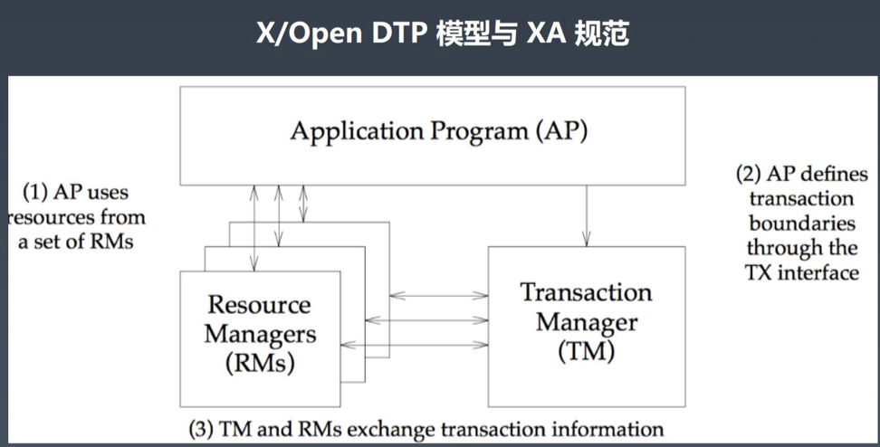
    - 应用程序（Application Program，简称AP）：用于定义事务边界（即定义事务的开始和结束），并且在事务边界内对资源进行操作。
    - 资源管理器（Resource Mananger，简称RM）：如数据库、文件系统等，并提供访问资源的方式。
    - 事务管理器（Transaction Manager，简称TM）：负责分配事务唯一标识，监控事务的执行进度，并负责事务的提交、回滚等。
  - 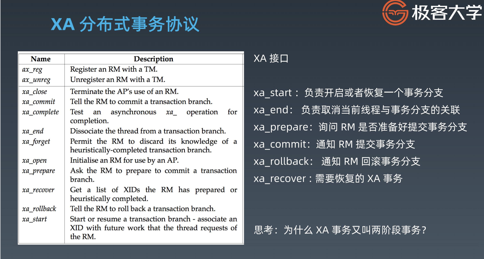
  
    - XA接口
      - xa_start: 负责开启或者恢复一个事务分支
      - xa_end：负责取消当前线程与事务分支的关联
      - xa_prepare：询问RM是否准备好提交事务分支
      - xa_commit：通知RM提交事务分支
      - xa_rollback：通知RM回滚事务分支
      - xa_recover：需要恢复的XA事务
    - 为什么XA事务又叫两阶段事务？
  - MySQL从5.0.3开始支持InnoDB引擎的XA分布式事务，MySQL Connector/J 从5.0.0版本开始支持XA
  - 在DTP模型中，MySQL属于资源管理器（RM）。分布式事务中存在多个RM，由事务管理器TM来统一进行协调
  - 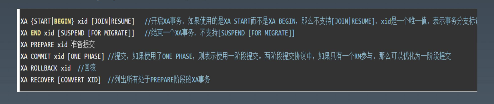
  - 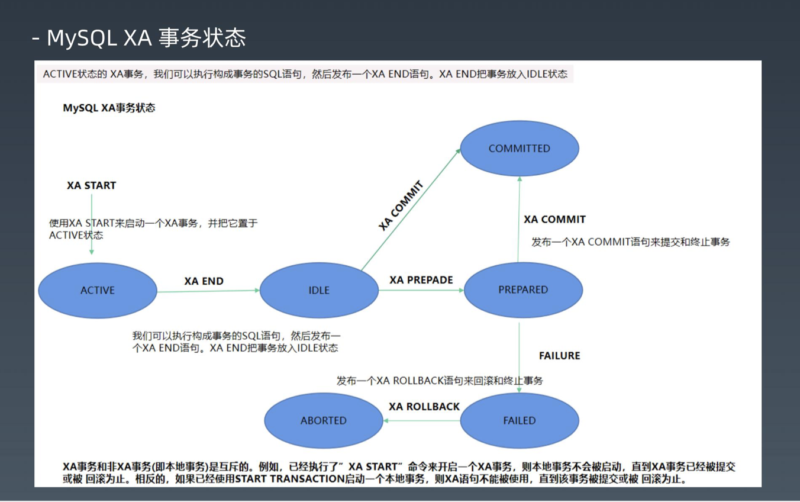
  - ACTIVE状态的XA事务，我们可以执行构成事务的SQL语句，然后发布一个XA END语句。XA END把事务放入IDLE状态
  
    - MySQL XA事务状态
      - XA START：使用XA START来启动一个XA事务，并把它置于ACTIVE状态
      - XA END：可以执行构成事务的SQL语句，然后发布一个XA END语句，XA END吧事务放入IDLE状态
      - XA COMMIT
      - XA PREPADE
      - FAILURE
      - XA ROLLBACK：发布一个XA ROLLBACK语句来回滚和终止事务
    - XA事务和非XA事务（本地事务）是互斥的。例如，已经执行了“XA START”命令来开启一个XA事务，则本地事务不会被启动，直到XA事务已经被提交或被回滚为止，相反的，如果已经使用了START TRANSACTION启动一个本地事务，则XA语句不能被使用，直到该事务被提交或回滚为止。
  - 完整的XA事务处理过程
  
    - 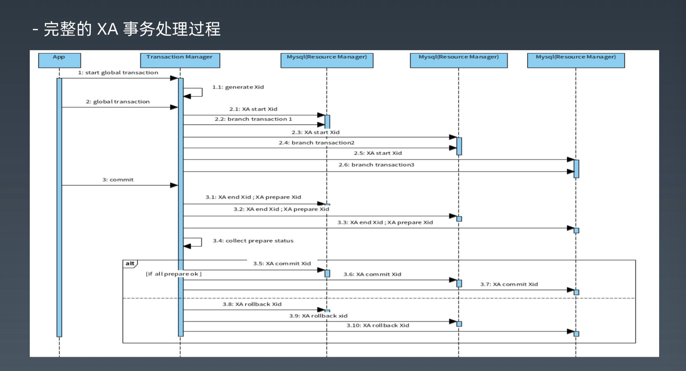
  - 单独MySQL的内部操作
  
    - 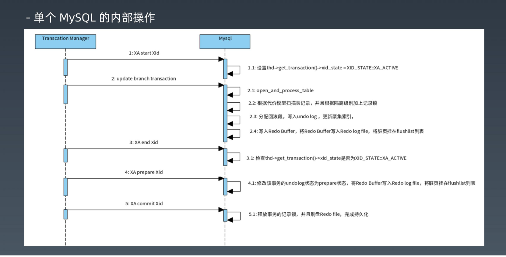
    - XA start Xid
      - 设置thd->get_transaction()->xid_state=XID_STATE::XA_ACTIVE
    - Update branch transaction 
      - Open_and_process_table
      - 根据代价模型扫描记录，并且根据隔离级别加上记录锁
      - 分配回滚段，写入undo log，更新聚集索引
      - 写入redo buffer，将redo buffer写入redo log file，将脏页挂在flushlist列表
    - XA end Xid
      - 检查thd->get_transaction()->xid_state是否为XID_STATE::XA_ACTIVE
    - XA prepare Xid
      - 修改事务的undolog状态为prepare状态，将Redo Buffer写入Redo log file，将脏页挂在flushlist列表
    - XA commit Xid
      - 释放事务的记录锁，并且刷盘Redo file，完成持久化。
  - 问题
  
    - XA过程中，事务失败怎么办
    - 业务SQL执行过程，某个RM崩溃怎么处理
    - 全部prepare后，某个RM崩溃怎么处理
    - commit时，某个RM崩溃怎么办
  - 5.7对MySQL XA的优化/bug修复
  
    - MySQL各版本对XA的支持与优化
    - MySQL < 5.7版本会出问题
      - 已经prepare的事务，在客户端退出或者服务宕机的时候，2PC的事务会被回滚
      - 在服务器故障重启提交后，相应的Binlog被丢失
      - MySQL 5.6版本在客户端退出的时候，自动把已经prepare的事务回滚了，那么MySQL为什么要这样做？这主要取决于MySQL的内部实现，MySQL5.7以前的版本，对于prepare的事务，MySQL是不会记录binlog的（官方说是减少fsync，起到了优化的作用）。只有当分布式事务提交的时候才会把前面的操作写入binlog信息，所以对于binlog来说，分布式事务与普通的事务没有区别，而preapre以前的操作信息都保存在连接的IO_CACHE中，如果这个时候客户端退出了，以前的binlog信息都会被丢失，再次重连后允许提交的话，会造成Binlog丢失，从而造成主从数据的不一致，所以官方在客户端退出的时候直接把已经prepare的事务都回滚了。
    - MySQL > 5.7版本的优化
      - MySQL对于分布式事务，在prepare的时候就完成了Binlog的操作，通过新增一种叫XA_prepare_log_event的event类型来实现，这是与以前版本的主要区别（以前版本prepare时不写Binlog）
  - 主流支持XA的框架，比较推荐Atomikos和narayana
  - XA默认不会改变隔离级别
    - 同步阻塞问题（一般情况下，不需要调高隔离级别）
      - 全局事务内部包含了多个独立的事务分支，这一组事务分支要不都成功，要不都失败。各个事务分支的ACID特性共同构成了全局事务的ACID特性/也就是将单个事务分支的支持的ACID特性提升一个层次（up a level）到分布式事务的范畴。即使在非分布式事务中（即本地事务），如果对操作读很敏感，我们也需要将事务隔离级别设置为SERIALIZABLE。而对于分布式事务来说，更是如此，可重复读隔离级别不足以保证分布式事务一致性。也就是说，如果我们使用mysql来支持XA分布式事务的话，那么最好将事务隔离级别设置为SERIALIZABLE，地球人都知道，SERIALIZABLE（串行化）是四个事务隔离级别中最高的一个级别，也是执行效率最低的一个级别。
    - 单点故障（成熟的XA框架需要考虑TM的高可用性）
      - 由于协调者的重要性，一旦协调者TM发生故障。参与者RM会一直阻塞下去。尤其在第二阶段，协调者发生故障，那么所有的参与者还都处于锁定事务资源的状态，而无法继续完成事务操作。（如果是协调者挂掉，可以重新选举一个协调者，但是无法解决因为协调者宕机导致的参与者处于阻塞状态的问题）
    - 数据不一致（极端情况下，一定有事务失败问题，需要监控和人工处理）
      - 在二阶段提交的阶段二中，当协调者向参与者发送commit请求之后，发生了局部网络异常或者在发送commit请求过程中协调者发生了故障，这会导致只有一部分参与者接收到了commit请求，而在这部分参与者接到commit请求之后就会执行commit操作，但是其他部分未接到commit请求的机制则无法执行事务提交，于是整个分布式系统便出现了数据不一致性的现象。

### 3.BASE柔性事务 *

- 本地事务 -> XA(2PC)->BASE
  - 如果将实现了ACID的事务要素的事务称为刚性事务的话，那么基于BASE事务要素的事务则称为柔性事务。BASE是基本可用、柔性状态和最终一致性这三个要素的缩写。
    - 基本可用（Basically Available）保证分布式事务参与方不一定同时在线。
    - 柔性状态（Soft state）则允许系统状态更新有一定的延时，这个延时对客户来说不一定能够察觉。
    - 而最终一致性（Eventually consistent）通常是通过消息传递的方式保证系统的最终一致性。
  - 在ACID事务中对隔离型的要求很高，在事务执行过程中，必须将所有的资源锁定。柔性事务的理念则是通过业务逻辑将互斥锁操作从资源层面上移至业务层面。通过放宽对强一致性要求，来换取系统吞吐量的提升。
  - 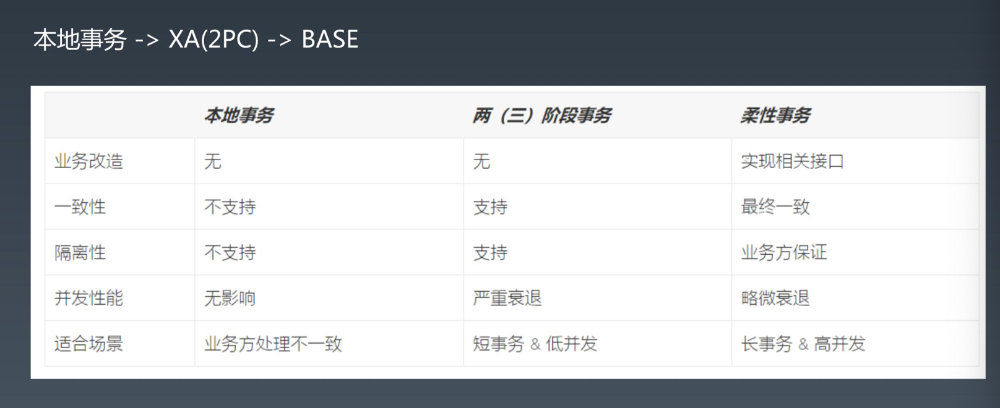
  - BASE柔性事务常见模式
    - TCC - 通过手动补偿处理
    - AT - 通过自动补偿处理

### 4.TCC/AT 以及相关框架 *

- 什么是TCC
  - BASE柔性事务TCC
    - TCC模式即将每个服务业务操作分为两个阶段，第一个阶段检查并预留相关资源，第二阶段根据所有服务业务的Try状态来操作，如果都成功，则进行Confirm操作，如果任意一个Try发生错误，则全部Cancel。
    - TCC使用要求就是业务接口都必须实现三段逻辑：
      - 准备操作Try：完成所有业务检查，预留必须的业务资源
      - 确认操作Confirm：真正执行的业务逻辑，不做任何业务检查，只使用Try阶段预留的业务资源。因此，只要Try操作成功，Confirm必须能成功。另外，Confirm操作需满足幂等性，保证一笔分布式事务能且只能成功一次。
      - 取消操作Cancel：释放Try阶段预留的业务资源。同样的，Cancel操作也需要满足幂等性。
  - TCC不依赖RM对分布式事务的支持，而是通过对业务逻辑的分解来实现分布式事务，不同于AT的是需要自行定义各个阶段的逻辑，对业务有侵入。
  - 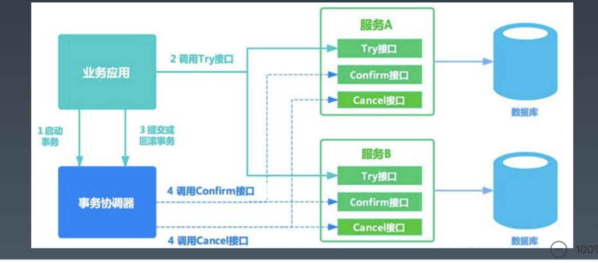
  - TCC需要注意的几个问题：
    - 允许空回滚
    - 防悬挂控制
    - 幂等设计
- 什么是SAGA
  - Saga模式没有try阶段，直接提交事务
  - 复杂情况下，对回滚操作的设计要求较高
  - 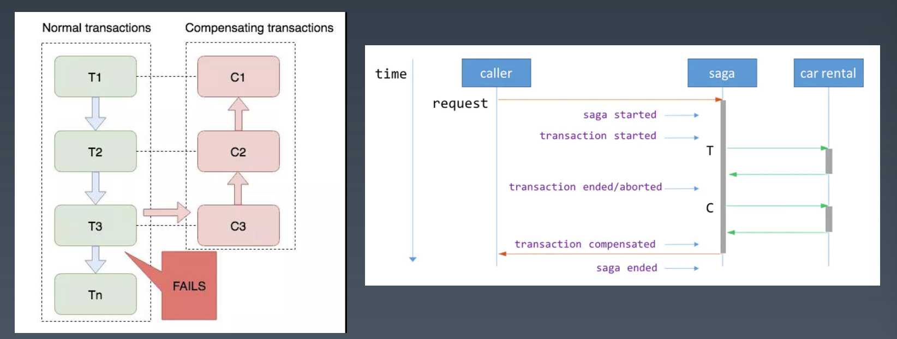
- 什么是AT
  - AT模式就是两阶段提交，自动生成反向SQL
  - 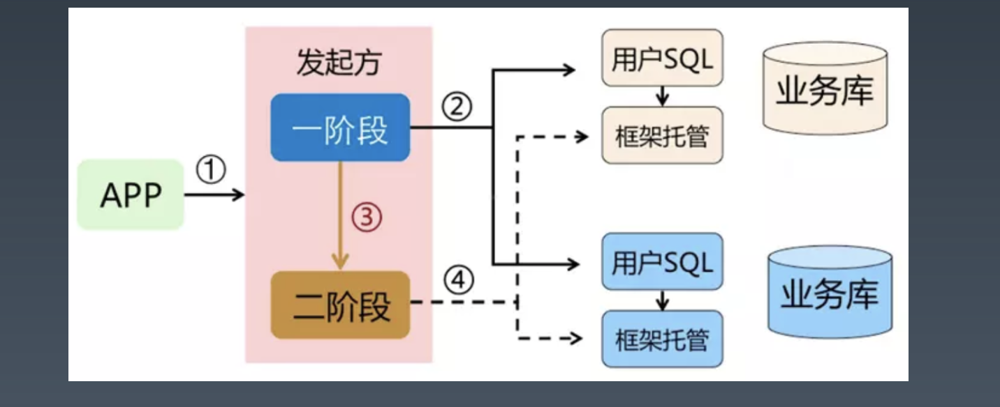
- 柔性事务下隔离级别
  - 事务特性
    - 原子性（Atomicity）：正常情况下保证
    - 一致性（Consistency）：在某个时间点，会出现A库和B库的数据违反一致性要求的情况，但是最终是一致的。
    - 隔离性（Isolation）：在某个时间点，A事务能够读到B事务部分提交的结果。
    - 持久性（Durability）：和本地事务一样，只要commit则数据被持久。
  - 隔离级别
    - 一般情况下都是读已提交（全局锁）、读未提交（无全局锁）
- Seata
  - Seata-TCC/AT柔性事务
    - Seata是阿里集团和蚂蚁金服联合打造的分布式事务框架。其AT事务的目标是在微服务架构下，提供增量的事务ACID语意，让开发者像使用本地事务一样，使用分布式事务，核心理念同Apache ShardingSphere一脉相承。
    - Seata AT事务模型包含TM（事务管理器），RM（资源管理器）和TC（事务协调器）。TC是一个独立部署的服务，TM和RM以jar包的方式同业务应用一同部署，它们同TC建立长连接，在整个事务声明周期内，保持远程通信。TM是全局事务的发起方，负责全局事务的开启，提交和回滚。RM时候全局事务的参与者，负责分支事务的执行结果上报，并且通过TC的协调进行分支事务的提交和回滚。
  - Seata管理的分布式事务的典型生命周期：
    - 
    - TM要求TC开始一个全新的全局事务
    - TC生成一个代表该全局事务的XID
    - XID贯穿于为辅的整个调用链
    - TM要求TC提交或回滚XID对应全局事务
    - TC驱动XID对应的全局事务下的所有分支事务完成提交或回滚。
  - Seata-TCC
    - 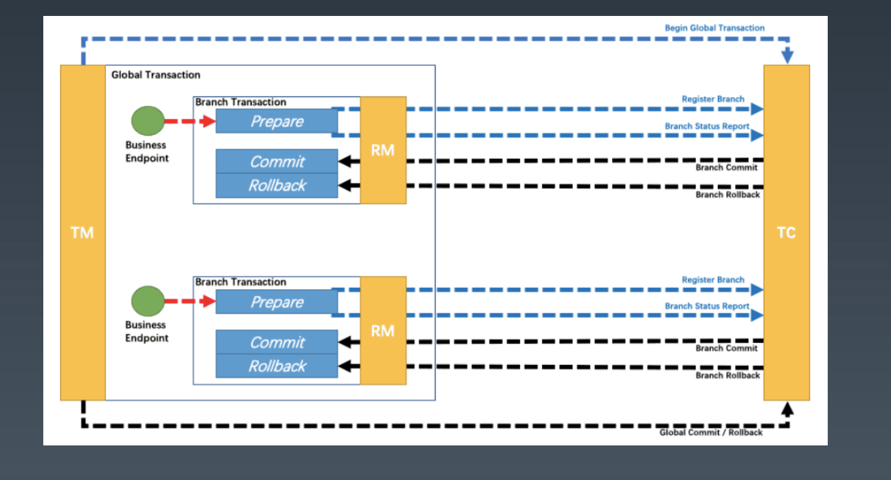
  - Seata-AT原理
    - 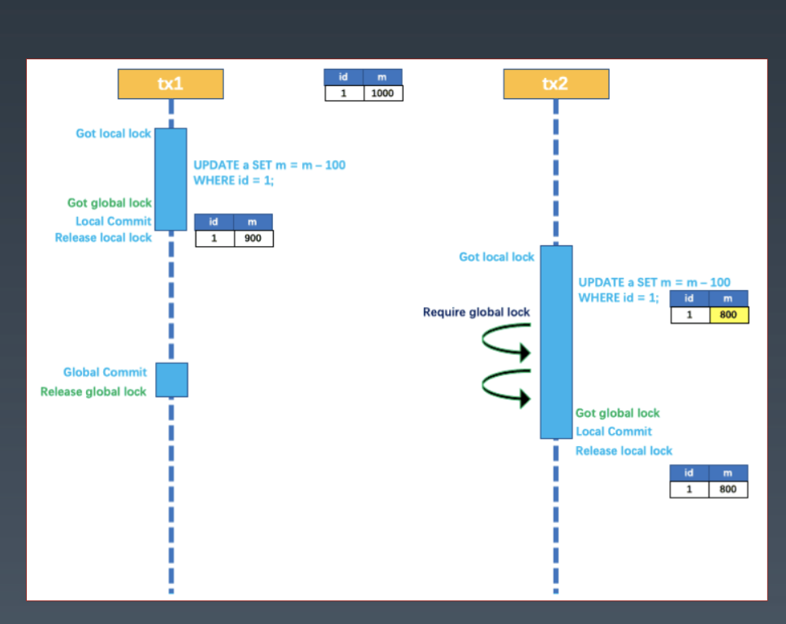
    - 两阶段提交协议的演变：
      - 一阶段：业务数据和回滚日志记录在同一个本地事务中提交，释放本地锁和连接资源
      - 二阶段：提交异步化，非常快速地完成。回滚通过一阶段的回滚日志进行反向补偿。
    - 通过全局锁的方式，实现读写隔离：
      - 本地锁控制本地操作
      - 全局锁控制全局提交
- hmily
  - Hmily是一个高性能分布式事务框架，开源于2017年，目前2800个Star，基于TCC原理实现，使用Java语言开发（JDK1.8+），天然支持Dubbo、SpringCloud、Motan等微服务框架的分布式事务。
  - 功能：
    - 支持嵌套事务（Nested transaction support）等复杂场景
    - 支持RPC事务恢复，超时异常恢复等，具有高稳定性
    - 基于异步Confirm和Cancel设计，相比其他方式具有更高性能
    - 基于SPI和API机制设计，定制性强，具有高扩展性
    - 本地事务的多种存储支持：redis/mongodb/zookeeper/file/mysql
    - 事务日志的多种序列化支持：java/hessian/kryo/protostuff
    - 基于高性能组件disruptor的异步日志性能良好
    - 实现了SpringBoot-Starter，开箱即用，集成方便。
    - 采用Aspect AOP切面思想与Spring无缝集成，天然支持集群
    - 实现了基于VUE的UI界面，方便监控和管理
  - 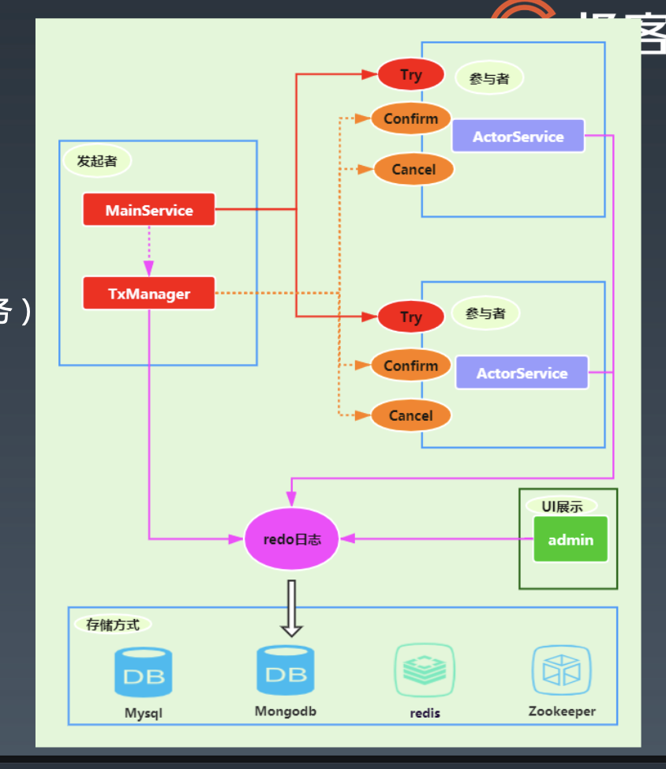
    - MainService：事务发起者（业务服务）
    - TxManager：事务协调者
    - ActorService：事务参与者（多个业务服务）
    - Try：事务执行
    - Confirm：事务确认
    - Cancel：事务回滚
    - Redo日志：可以选择任意一种进行存储
    - 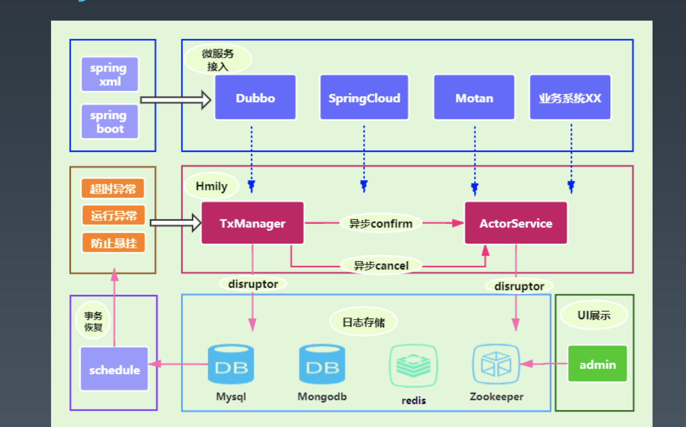

### 5.ShardingSphere对分布式事务的支持

- 由于应用的场景不同，需要开发者能够合理的在性能与功能之间权衡各种分布式事务
  - 强一致的事务与柔性事务的API和功能并不完全相同，在它们之间并不能做到自由的透明切换。在开发决策阶段，就不得不在强一致的事务和柔性事务之间抉择，使得设计和开发成本被大幅增加。
  - 基于XA的强一致事务相对简单，但是无法很好的应对互联网的高并发或者复杂系统的长事务场景；柔性事务则需要开发者对应用进行改造，接入成本非常高，并且需要开发者自行实现资源锁定和反向补偿。
  - 整合现有的成熟事务方案，为本地事务、两阶段事务和柔性事务提供统一的分布式事务接口，并弥补当前方案的不足，提供一站式的分布式事务解决方案是Apache ShardingSphere分布式事务模块的主要设计目标。
- ShardingSphere支持XA事务的常见几个开源实现
  - 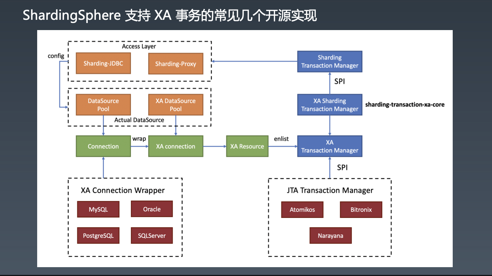
- ShardingSphere支持Seata的柔性事务
  - 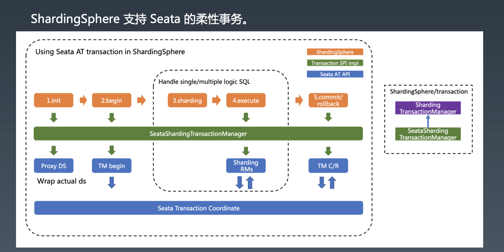
  - 

### 6.总结与回顾

