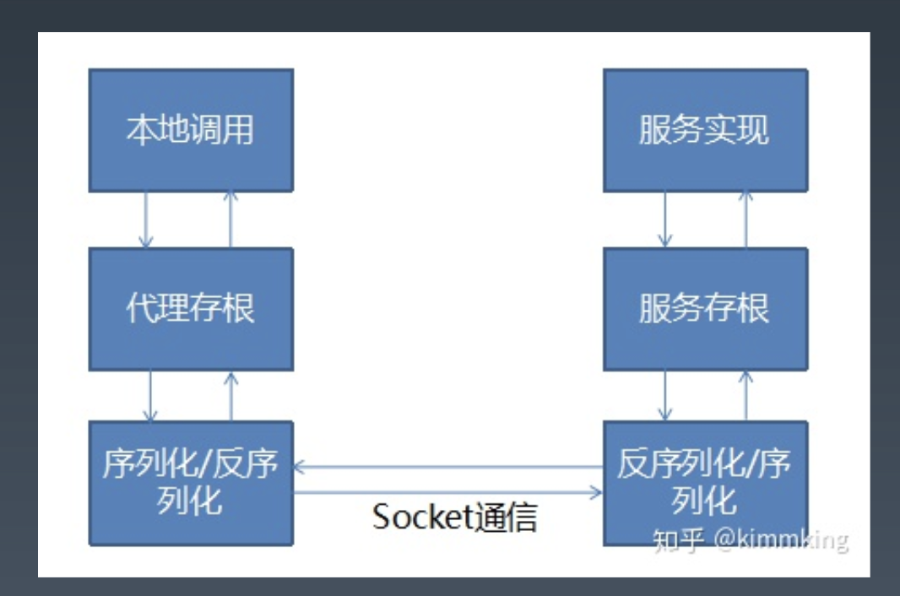
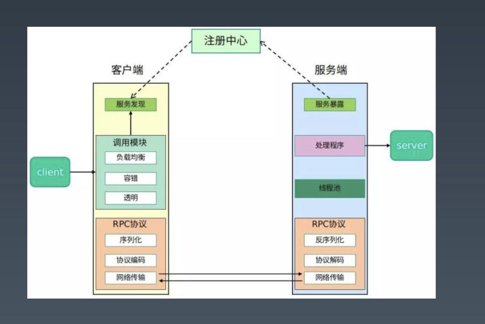
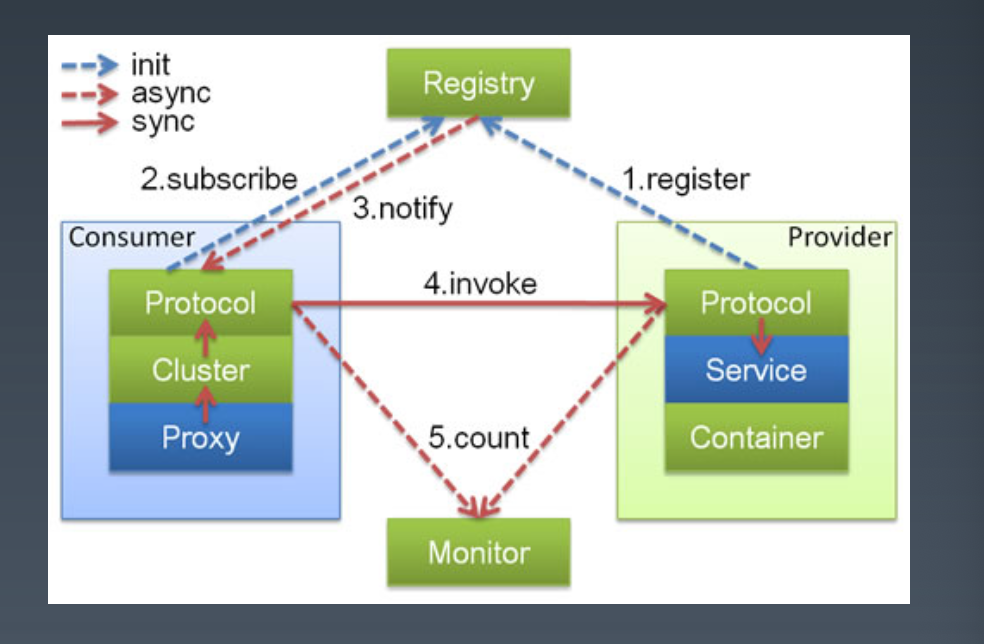
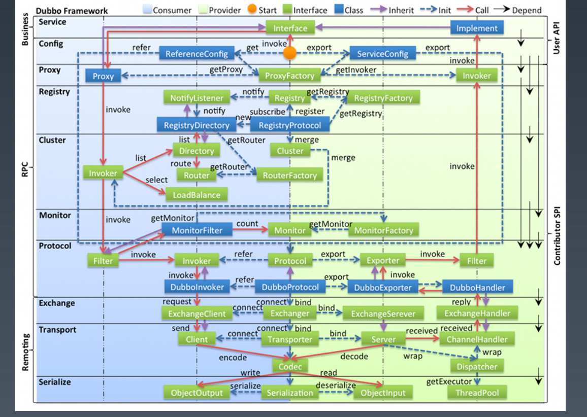
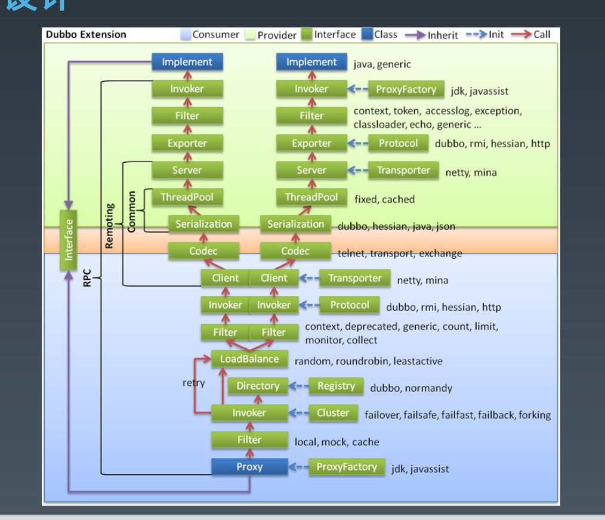
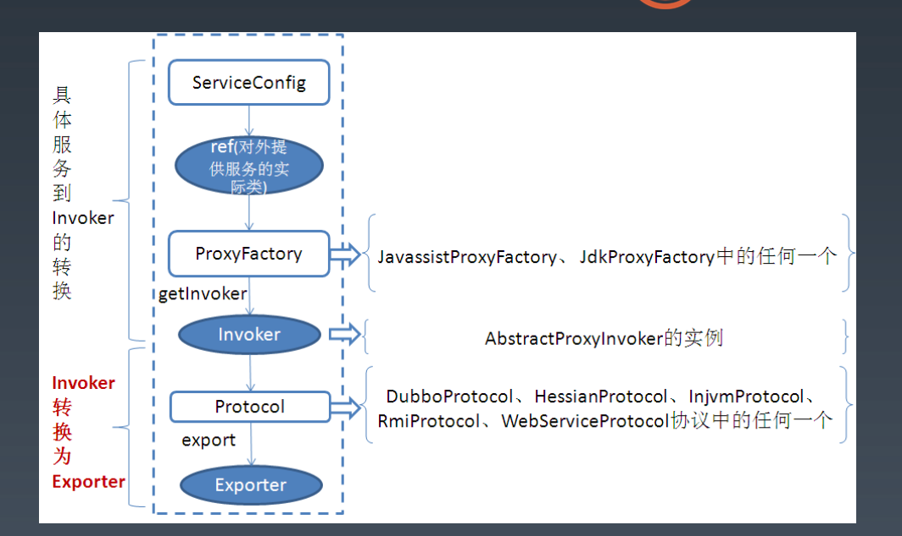
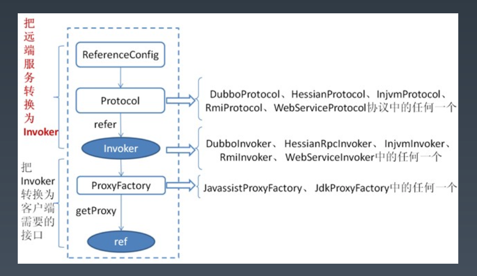
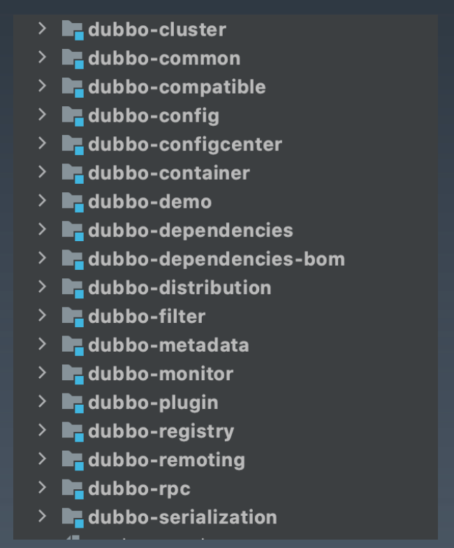

学习笔记

# 分布式服务-RPC与分布式服务化

### 1.RPC基本原理

- RPC是什么	
  - RPC是远程过程调用（Remote Procedure Call）的缩写形式
  - RPC的概念与技术早在1981年由Nelson提出
  - 简单来说，就是“像调用本地方法一样来调用远程方法”
- RPC原理
  - 
  - 核心是代理机制
  - 本地代理存根：Stub
  - 本地序列化反序列化
  - 网路通信
  - 远程序列化反序列化
  - 远程服务存根：Skeleton
  - 调用实际业务服务
  - 原路返回服务结果
  - 返回给本地调用方
- RPC原理 -- 1.设计
  - RPC是基于接口的远程服务嗲用
  - 本地应用程序与远程应用策划个女婿，分别需要共享什么信息，角色有什么不同
  - 共享：POJO实体类定义，接口定义
  - REST/PB下，真的不需要嘛？另一种选择：WSDL/WADL/IDL
  - 远程->服务提供者，本地->服务消费者
- RPC原理 -- 2.代理
  - RPC是基于接口的远程服务调用
  - Java下，代理可以选择动态代理，或者AOP实现
  - C# 直接由远程代理
  - Flex可以使用动态方法和熟悉？
- RPC原理 -- 3.序列化
  - 序列化和反序列化的选择：
    - 语言原生的序列化，RMI，Remoting
    - 二进制平台无关，Hessian，avro，kyro，fst等
    - 文本，JSON、XML等
- RPC原理 -- 4.网络传输
  - 最常见的传输方式
    - TCP/SSL
    - HTTP/HTTPS
- RPC原理 -- 5.查找实现类
  - 通过接口查找服务端的实现类
  - 一般是注册方式，例如dubbo默认将接口和实现类配置到Spring

### 2.RPC技术框架

- 很多语言都内置了RPC技术
- JAVA RMI、.NET Remoting
- 常见的RPC技术
  - Corba/RMI/.NET Remoting
  - JSON RPC，XML RPC，WebService（Axis2，CXF）
  - Hessian，Thrift，Protocol Buffer，gRPC

### 3.如何设计一个RPC

- 从哪些方面考虑
- 基于共享接口还是IDL
- 动态代理 or AOP
- 序列化用什么？ 文本 or 二进制？
- 基于TCP还是HTTP？

### 4.从RPC到分布式服务化

- 具体的分布式业务场景里，除了能够调用远程方法，还需要考虑什么？
  - 多个相同服务如何管理
  - 服务的注册发现机制
  - 如何负责均衡，路由等集群功能
  - 熔断、限流等治理能力
  - 重试等策略
  - 高可用、监控、性能等等
- 典型的分布式服务化架构
  - 

### 5.总结与回顾

# 分布式服务-Dubbo技术详解

### 1.Dubbo框架介绍

- Dubbo的发展历史
  - 开源期（2011-2013，横空出世）：Dubbo是阿里巴巴B2B开发的，2011年开源
  - 沉寂期（2013-2017，潜龙在渊）：2013年到2017年，Dubbo的维护程度很低
  - 复兴期（2017-2019，朝花夕拾）：2017年8月份重启维护，2018年2月加入Apache孵化器，2019年5月顺利毕业
  - Dubbo产生于阿里巴巴B2B的实际业务需要
  - 淘宝的HSF，随着B2B退市，团队分流，导致Dubbo停滞
  - 2013年以后，国内Dubbo存量用户一直最多，增量Spring Cloud后来局上，类似IE浏览器与Chrome浏览器
  - 当当、京东等公司的服务化都是基于Dubbo实现的，四大行都有使用
- Dubbo的主要功能
  - Apache Dubbo是一款高性能、轻量级的开源Java服务框架
  - 六大核心能力：
    - 面向接口代理的高性能RPC调用
      - 提供高性能的基于代理的远程调用能力，服务以接口为粒度，为开发者屏蔽远程调用底层细节。
    - 智能负载均衡
      - 内置多种负载均衡策略，智能感知下游节点健康状况，显著减少调用延迟，提高系统吞吐量
    - 服务自动注册和发现
      - 支持多种注册中心服务，服务实例上下线实时感知
    - 高度可扩展能力
      - 遵循微内核+插件的设计原则，所有核心能力如Protocol、Transport、Serialization被设计为扩展点，平等对待内置实现和第三方实现
    - 运行期流量调度
      - 内置条件、脚本等路由策略，通过配置不同的路由规则，轻松实现灰度发布，同机房优先等功能。
    - 可视化的服务治理与运维
      - 提供丰富服务治理、运维工具：随时查询服务元数据、服务健康状态及调用统计，实时下发路由策略、调整配置参数。
  - 
  - 基础功能：RPC调用
    - 多协议（序列化、传输、RPC）
    - 服务注册发现
    - 配置、元数据管理
    - 框架分层设计，可任意组织和扩展
  - 扩展功能：集群、高可用、管控
    - 集群、负载均衡
    - 治理、路由
    - 控制台、管理与监控
    - 灵活扩展+简单易用，是Dubbo成功秘诀

### 2.Dubbo技术原理

- 整体架构
  - 
  - config配置层：对外配置接口，以ServiceConfig、ReferenceConfig为中心，可以直接初始化配置类，也可以通过spring解析配置生成配置类
  - proxy服务代理层：服务接口透明代理，生成服务的客户端Stub和服务器端Skeleton，以ServiceProxy中心，扩展接口为ProxyFactory
  - registry注册中心层：
    - 封装服务地址的注册与发现，以服务URL为中心，扩展接口为RegistryFactory，Registry，RegistryService
  - cluster路由层
    - 封装多个提供者的路由及负载均衡，并桥接注册中心，以Invoker为中心，扩展接口Cluster、Directory、Router、LoadBalance
  - monitor监控层
    - RPC调用次数和调用时间监控，以Statistics为中心，扩展接口为MonitorFactory、Monitor、MonitorService
  - protocol远程调用层：封装RPC调用，以Invocation，Result为中心，扩展接口为Protocol、Invoker、Exporter
  - exchange信息交换层：
    - 封装请求响应模式，同步转异步，以Request、Response为中心，扩展接口Exchanger、ExchangeChannel、ExchangeClient、ExchangeServer
  - transport网络传输层
    - 抽象mina和netty为统一接口，以Message为中心，扩展接口为Channel、Transporter、Client、Server、Codec
  - serialize数据序列化层
    - 可复用的一些工具，扩展接口Serialization、ObjectInput、ObjectOutput、ThreadPool。
- 
  - SPI的应用
    - SPI与API
      - ServiceLoader机制
        - META_INF/接口全限定名，文件内容为实现类（ShardingSphere使用）
      - 其他两个类似的机制：Callback与EventBus
      - Dubbo的SPI扩展，最关键的SPI：Protocol
        - xxx=com.alibaba.xxx.XxxProtocol
      - 启动时装配，并缓存到ExtensionLoader中
  - 服务如何暴露
    - 
  - 服务如何引用
    - 
  - 集群与路由
    - Cluster
      - Directory：return List<Invoker>
      - Router：选取此次调用可以提供服务的invoker集合，Condition，Script，Tag
      - LoadBalance：从上述集合选取一个作为最终调用者Random、RoundRobin、ConsistentHash
  - 泛化引用
    - GeneraicService
      - 当知道接口、方法和参数，不用存根方式，而是用反射方式调用任何服务。
  - 隐式传参
    - Context模式
      - RpcContent.getContext().setAttachment("index", "1");
      - 此参数可以传播到RPC调用的整个过程
  - mock
    - ` <dubbo.reference id="helloService" interface="io.kmmking.HelloService" mock="true" timeout="1000" check="false">`
    - 需要实现一个io.kimmking.HelloServiceMock类
    - 可以方便用来做测试

### 3.Dubbo应用场景

- 分布式服务化改造
  - 业务系统规模复杂，垂直拆分改造
  - 数据相关改造
  - 服务设计
  - 不同团队的配合
  - 开发、测试运维
- 开发平台
  - 平台发展的两个模式：开放模式、容器模式
  - 将公司的业务能力开发出来，形成开发平台，对外输出业务或技术能力
  - API与SPI，分布式服务化与集中式ESB
- 直接作为前端使用的后端（BFF）
  - 基于Dubbo实现BFF
  - 作为BFF（Backend For Frontend）给前端（Web或Mobile）提供服务
  - 一般不太建议这种用法
  - 灵活性，更好的支持前台业务，向中台发展。
- 通过服务化建设中台
  - 基于Dubbo实现业务中台
  - 将公司的所有业务服务能力，包装成API，形成所谓的业务中台
  - 前端业务服务，各个业务线，通过调用中台的业务服务，灵活组织自己的业务
  - 从而实现服务的服用能力，以及对于业务变化的快速响应。

### 4.Dubbo最佳实践

- 开发分包
  - 建议将服务接口、服务模型、服务异常等均放在API包中，因为服务模型和异常也是API的一部分，这样做也符合分包原则：重用发布等价原则（REP），共同重用原则（CRP）
  - 服务接口尽可能大粒度，每个服务方法应代表一个功能，而不是某功能的一个步骤，否则将面临分布式事务问题，Dubbo暂未提供分布式事务支持。
  - 服务接口建议以业务场景为单位划分，并对相近业务做抽象，防止接口数量爆炸
  - 不建议使用过于抽象的通用接口，如：Map query(Map)，这样的接口没有明确语义，会给后期维护带来不便
- 环境隔离与分组
  - 怎么做多环境的隔离？
    - 部署多套？
    - 多注册中心机制
    - group机制
    - 版本机制
  - 服务接口增加方法，或服务模型增加字段，可向后兼容，删除方法或删除字段，将不兼容，枚举类型新增字段也不兼容，需通过变更版本号升级。
- 参数配置
  - 通用参数以consumer端为准，如果consumer端没有设置，使用provider数值
  - 建议在Provider端配置的Consumer端属性有：
    - timeout：方法调用的超时时间
    - retries：失败重试次数，缺省是2
    - loadbalance：负载均衡算法，缺省是随机random
    - actives：消费者端的最大并发调用限制，即当Consumer对一个服务的并发调用到上限后，新调用会阻塞直到超时，可以配置在方法或服务上。
    - 建议在Provider端配置的Provider端属性有：
      - threads：服务线程池大小
      - executes：一个服务提供者并行执行请求上限，即当Provider对一个服务的并发调用达到上限后，新调用会阻塞，此时Consumer可能会超时。可以配置在方法或服务上。
- 容器化部署
  - 注册的IP问题，容器内提供者使用的IP，如果注册到zk，消费者无法访问
  - 两个解决办法
    - docker使用宿主机网络
      - `docker xxx -net xxxxx`
    - docker 参数指定注册的IP和端口
      - DUBBO_IP_TO_REGISTRY - 注册到注册中心的IP地址
      - DUBBO_PORT_TO_REGISTRY - 注册到注册中心的端口
      - DUBBO_IP_TO_BIND - 监听IP地址
      - DUBBO_PORT_TO_BIND - 监听端口
- 运维和监控
  - Admin功能较简单，大规模使用需要定制开发，整合自己公司的运维监控系统
  - 可观测性：tracing、metrics、logging（ELK）
  - APM
  - Promethus + Grafana
- 分布式事务
  - 柔性事务，SAGA、TCC、AT
  - Seata
  - hmily + dubbo
  - 不支持XA
- 重试与幂等
  - 服务调用失败默认重试2次，如果接口不是幂等的，会造成业务重复处理
  - 如何设计幂等接口？
    - 去重-->(bitmap --> 16M), 100w
    - 类似乐观锁机制
- 项目结构与重点模块
  - 
  - 核心重点模块
    - common
    - config
    - filter
    - rpc/remoting/serialization
  - 集群与分布式
    - cluster
    - registry/configcenter/metadata
- 学习复杂项目源码的技巧
  - 不要一上来就关注于每行代码，挑重点代码，重点类，重点方法看。（跟看书一样）
  - 代码是静态的，实际运行时是什么调用关系，怎么处理，数据是什么格式、怎么传递，想要了解这些，最好在跑起来的demo里Dubbo重点类和方法打断点，debug的过程跟踪看。（推荐做笔记）
  - 最好组成一个小组，大家相互深入研究，然后相互分享，节省时间，系统学习。（费曼学习法）
- 具体的学习方法
  - 实现一个新的RPC，主要是实现入口点XXXProtocol
  - 同理，了解一个RPC，也需要去debug XXXProtocol
  - 例如DubboProtocol：
    - 想了解Dubbo协议下服务如何暴露，在DubboProtocol的xeport方法加断点
    - 想了解Dubbo协议下服务如何引用，在DubboProtocol的protocolBindingRefer方法加断点
    - 想了解Dubbo协议下一个请求进来如何处理，在DubboProtocol的requestHandler的reply方法加断点。

### 5.如何看Dubbo源码

### 6.总结回顾