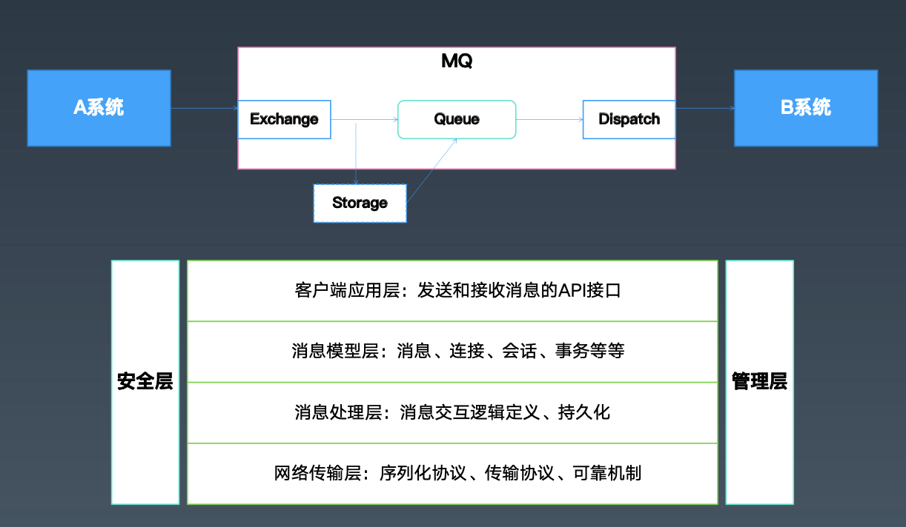

学习笔记

# 第23课 分布式缓存-Redis高可用/Redission/Hazelcast

### 1.Redis集群与高可用

- Redis主从复制：从单机到多节点
  - SLAVEOF 127.0.0.1 6379
  - 也可以在配置文件中配置
  - 注意：从节点只读、异步复制
- Redis Sentinel 主从切换：走向高可用
  - 可以做到监控主从节点的在线状态，并做切换（基于raft协议）
  - 两种启动方式：
    - redis-sentinel sentinel.conf
    - redis-server redis.conf --sentinel
  - Sentinel.conf配置
    - sentinel monitor my master 127.0.0.1 6379 2
    - sentinel down-after-milliseconds my master 60000
    - sentinel failover-timeout mymaster 180000
    - sentinel parallel-syncs mymaster 1
  - 不需要配置从节点，也不需要配置其他sentinel信息
- Redis Cluster：走向分片
  - 主从复制从容量角度来说，还是单机
  - Redis Cluster通过一致性hash的方式，将数据分散到多个服务器节点：先设计16384个哈希槽，分配到多台redis-server。当需要在Redis Cluster中存取一个key时，Redis客户端先对key使用crc16算法计算一个数值，然后对16384取模，这样每个key都会对应一个编号在0-16383之间的哈希值，然后在此槽对应的节点上操作。
  - cluster-enabled yes
  - 注意
    - 节点间使用gossip通信，规模<1000
    - 默认所有槽位可用，才提供服务
    - 一般会配合主从模式使用

### 2.Redisson介绍

- Redis的Java分布式组件库-Redission
  - 基于Netty NIO，API线程安全
  - 亮点：大量丰富的分布式功能特性，比如JUC的线程安全集合和工具的分布式版本，分布式的基本数据类型和锁等。

### 3.Hazelcast介绍

- 内存网格 - Hazelcast

  - Hazelcast IMGD（in-memory data grid）是一个标准的内存网格系统；它具有以下的一些基本特性：
    - 分布式的：数据按照某种策略尽可能均匀的分布在集群的所有节点上
    - 高可用：集群的每个节点都是active模式，可以提供业务查询和数据修改事务；部分节点不可用，集群依然可以提供业务服务
    - 可扩展的：能按照业务需求增加或者减少服务节点
    - 面向对象的：数据模型是面向对象和非关系型的。在Java语言应用程序中引入hazelcast client api是相当简单的。
    - 低延迟：基于内存的，可以使用堆外内存

- 内存网格-Hazelcast部署模式

  - client-server模式
  - 嵌入（Embedded）模式

- 内存网格-Hazelcast数据分区

  - 以Map结构说明如下：

    - 数据集默认分为271个分区；可以通过hazelcast.partition.count配置参数
    - 所有分区均匀分布在集群的所有节点上；同一个节点不会同时包含一个分区的多个副本（副本总是分散的以保证高可用）。

  - 副本配置

    - ```xml
      <hazelcast>
      	<map name="default">
      		<backup-count>0</backup-count> 
      		<async-backup-count>1</async-backup-count>
      	</map>
      </hazelcast>
      ```

- 内存网格-Hazelcast集群与高可用

  - AP，集群自动管理
  - 扩容和弹性，分区自动rebalance，业务无感知

- 内存网格-Hazelcast事务支持

  - ```java
    TransactionContext context = hazelcastInstance.newTransactionContext(options);
    context.beginTransaction(); 
    try {
      // do other things
      context.commitTransaction(); 
    } catch (Throwable t) {
    	context.rollbackTransaction(); 
    }
    ```

  - 支持两种事务类型：

    - ONE_PHASE：只有一个提交阶段；在节点宕机等情况下可能导致系统不一致
    - TWO_PHASE: 在提交前增加一个prepare阶段；该阶段检查提交冲突，然后将commit log拷贝到一个本分节点；如果本节点宕机，备份节点会完成事务提交动作。

- 内存网格-Hazelcast数据亲密性

  - 确保业务相关的数据在同一个集群节点上，避免操作多个数据的业务事务在执行中通过网络请求数据，从而实现更低的事务延迟。

  - 通过PartitionAware接口，可以将相关数据定位在相同的节点上

    - ```java
      public interface PartitionAware<T> {
      	T getPartitionKey(); 
      }
      ```

  - 自定义：PartitioningStrategy

    - ```xml
      <map name="name-of-the-map">
        <partition-strategy> com.hazelcast.partition.strategy.StringAndPartitionAwarePartitioningStrategy
        </partition-strategy> 
      </map>
      ```

- 内存网格-Hazelcast控制台

  - ～

### 4.总结回顾


# 第24课 分布式消息--消息队列基础

### 1.系统间通信方式

- 基于文件 - 明显不方便，不及时
- 基于共享内存 - 
- 基于IPC
- 基于Socket - 使用麻烦，多数情况下不如RPC
- 基于数据库 - 不实时，但是经常有人拿数据库来模拟消息队列
- 基于RPC - 调用关系复杂，同步处理，压力大的时候无法缓冲
- 期望一种通信方式
  - 可以实现异步的消息通信
  - 可以简化参与各方的复杂依赖关系
  - 可以在请求量很大的时候，缓冲一下 > 类比线程池里的Queue
  - 某些情况下能保障消息的可靠性，甚至顺序
- MQ - Message Queue/Messaging System/Message Middlewire

### 2.从队列到消息服务

- MQ的四大作用
  - 对比其他通信模式，MQ的优势在于：
    - 异步通信 - 异步通信，减少线程等待，特别是处理批量等大事务、耗时操作
    - 系统解耦 - 系统不直接调用，降低依赖，特别是不在线也能保持通信最终完成
    - 削峰平谷 - 压力大的时候，缓冲部分请求信息，类似于背压处理
    - 可靠通信 - 提供多种消息模式、服务质量、顺序保障等。

### 3.消息模式与消息协议 *

- 消息处理模式
  - 常见的两种模式
    - 点对点： PTP，Point-To-Point，对应于Queue
    - 发布订阅：PubSub，Publish-Subscribe，对应于Topic
- 消息处理的保障
  - 三种Qos（注意：这是消息语义的，不是业务语义的）
  - At most once，至多一次，消息可能会丢失但是不会重复发送
  - At least once，至少一次，消息不会丢失，但是可能会重复
  - Exactly once，精确一次，每条消息肯定会被传输一次且仅一次
  - 消息处理的事务性：
    - 通过确认机制实现事务性
    - 可以被事务管理器管理，甚至可以支持XA
- 消息有序性
  - 同一个Topic或Queue的消息，保障按顺序投递
  - 注意：如果做了消息分区，或者批量预取之类的操作，可能就没有顺序了。
- 消息协议
  - STOMP
  - JMS+
  - AMQP*
  - MQTT*
  - XMPP
  - Open Messaging
- JMS（Java Message Service）
  - 关注于应用层的API协议（～类似JDBC）
  - Message结构与Queue概念
    - Body\Header\Property,messages types
    - Queue\Topic\TemporaryQueue\TemporaryTopic
    - Connection\Session\Producer\Consumer\DurableSubscription
  - Messaging行为
    - PTP&Pub-Sub
    - 持久化
    - 事务机制
    - 确认机制
    - 临时队列
- 消息队列的通用结构
  - 
- 开源消息中间件/消息队列
  - 三代
    - ActiveMQ/RabbitMQ
    - Kafka/RocketMQ
    - Apache Pulsar

### 4.ActiveMQ消息中间件

- ActiveMQ介绍
  - 高可靠的、事务性的消息队列
  - 当前应用最广泛的开源消息中间件
  - 项目开始与2005年CodeHaus、2006年成员Apache项目
  - 后来与HornetQ合并，新的消息队列叫：Artemis，目前是ActiveMQ的子项目
  - 功能最全的开源消息队列
- 主要功能
  - 多种语言和协议编写客户端
    - 语言：Java、C、C++、C#、Ruby、Perl、Python、PHP等
    - 应用协议：OpenWire、Stomp REST、WS Notification、XMPP、AMQP、MQTT
  - 完全支持JMS1.1和J2EE1.4规范（持久化、XA消息、事务）
  - 与Spring很好地集成，也支持常见J2EE服务器
  - 支持多种传送协议：in-VM，TCP，SSL，NIO，UDP，JGroups，JXTA
  - 支持通过JDBC和journal提供高速的消息持久化
  - 实现了高性能的集群模式

### 5.ActiveMQ使用示例 *

- 使用场景
  - ActiveMQ的使用场景
    - 所有需要使用消息队列的地方
    - 订单处理、消息通知、服务降级等等
    - 特别地，纯Java实现，支持嵌入到应用系统
  - 

### 6.总结回顾


