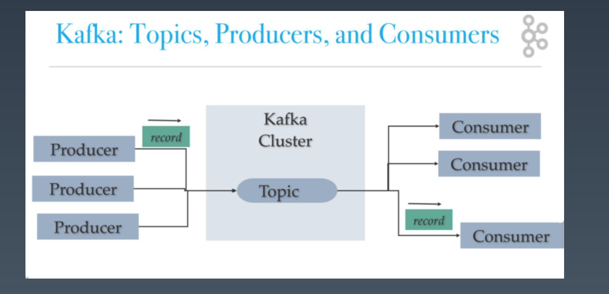
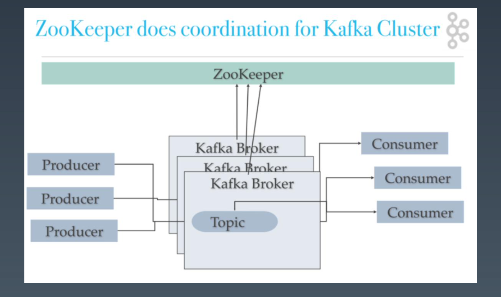
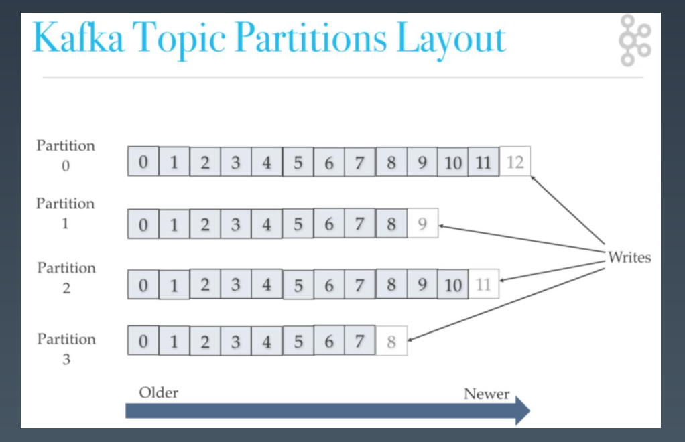
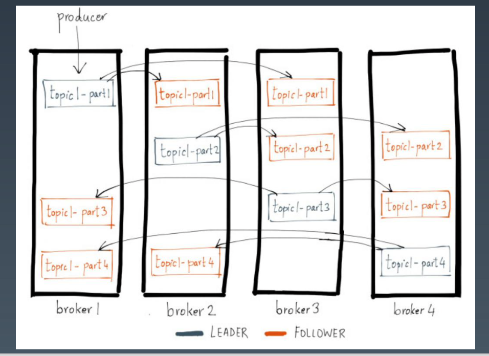
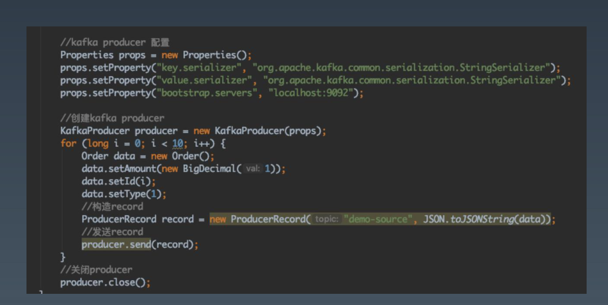
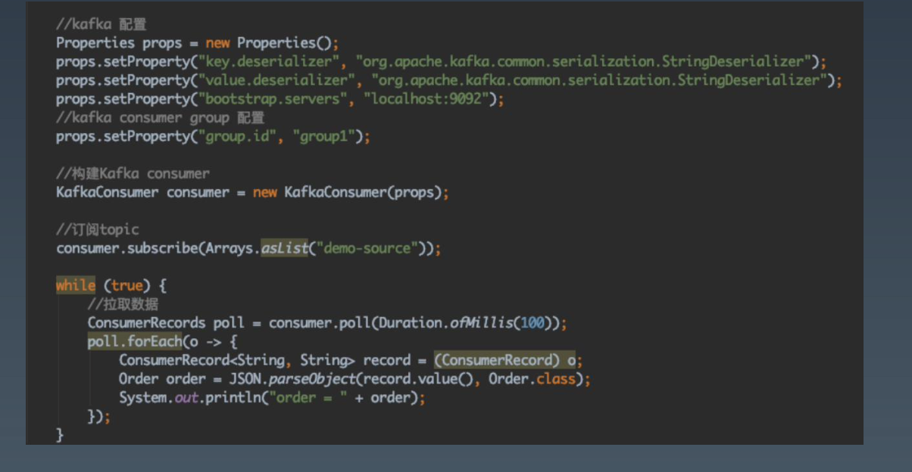

学习笔记

# 第25课 分布式消息--Kafka消息中间件

### 1.Kafka概念和入门

- 什么是Kafka
  - Kafka是一个消息系统，由LinedIn于2011年设计开发，用作LinkedIn的活动流（Activity Stream）和运营数据处理管道（Pipeline）的基础
  - Kafka是一种分布式的，基于发布/订阅的消息系统。主要设计目标如下：
    - 以时间复杂度为O(1)的方式提供消息持久化能力，即使对TB级以上数据也能保证常数时间复杂度的访问性能
    - 高吞吐率。即使在非常廉价的商用机器上也能做到单机支持每秒100K条以上消息的传输。
    - 支持Kafka Server间的消息分区，及分布式消费，同时保证每个Partition内的消息顺序传输
    - 同时支持离线数据处理和实时数据处理
    - Scale out：支持在线水平扩展
- Kafka的基本概念
  - Broker：Kafka集群包含一个或多个服务器，这种服务器被称为broker
  - Topic：每条发布到Kafka集群的消息都有一个类别，这个类别被称为Topic。（物理上不同Topic的消息分开存储，逻辑上一个Topic的消息虽然保存于一个或多个borker上，但用户只需指定消息的Topic即可生产或消费数据而不必关心数据存于何处）。
  - Partition：Partition是物理上的概念，每个Topic包含一个或多个Partition。
  - Producer：负责发布消息到Kafka broker
  - Consumer：消息消费者，向Kafka broker读取消息的客户端
  - Consumer Group：每个Consumer属于一个特定的Consumer Group）可为每个Consumer指定group name，若不指定group name则属于默认的group）。
- 单机部署结构
  - kafka单机消息处理
  - 
- 集群部署结构
  - Kafka集群消息处理
  - 
- Topic和Partition
  - 多Partition支持水平扩展和并行处理，顺序写入提升吞吐性能
    - 
- Partition和Replica
  - 每个partition可以通过副本因子添加多个副本
  - 
- Topic特性
  - 通过partition增加可扩展性
  - 通过孙旭写入达到高吞吐
  - 多副本增加容错性

### 2.Kafka的简单使用*

- 单机安装部署
  - 1、kafka安装
    - 下载解压
  - 2、启动kafka：
    - 命令行下进入kafka目录
    - 修改配置文件 `vim config/server.properties`
    - 打开 `listeners=PLAINTEXT://localhost:9092`
    - `bin/zookeeper-server-start.sh config/zookeeper.properties`
    - `bin/kafka-server-start.sh config/server.properties`
  - 3.命令行操作kafka
    - `bin/kafka-topics.sh --zookeeper localhost:2181 --list`
    - `bin/kafka-topics.sh --zookeeper localhost:2181 --create --topic testk --partitons 4 --replication-factor 1`
    - `bin/kafka-topics.sh --zookeeper localjost:2181 --describe --topic testlk`
    - `bin/kafka-console-consumer.sh --bootstrap-server localhost:9092 --from-beginning --topic testk`
    - `bin/kafka-console-producer.sh --bootstrap-server localhost:9092 --topic testk`
  - 简单性能测试
    - `bin/kafka-producer-perf-test.sh --topic testk --num-records 100000 --record-size 1000 --throughput 2000 --producer-props boostrap.servers=localhost:9092`
    - `bin/kafka-consumer-perf-test.sh --boostrap-server localhost:9092 --topic testk --fetch-size 1048576 --messages 100000 --threads 1`
- Java中使用Kafka发送接收消息
  - 基于Kafka Client发送和接收消息--极简生产者
  - 
  - 基于Kafka Client发送和接收纤细--极简消费者
  - 

### 3.Kafka的集群配置*

- 集群安装部署01
- 集群安装部署02
- 集群安装部署03
- 集群与多副本的说明
  - ISR：In-Sync Replica
  - Rebalance：broker和consumer group的rebalance
  - 热点分区：需要重新平衡

### 4.Kafka的高级特性*

- 生产者-执行步骤

  - 客户端实现序列化，分区，压缩操作

- 生产者-确认模式

  - ack=0：只发送不管有没有写入到broker
  - ack=1:写入到leader就认为成功
  - ack=-1/all：写入到最小的复本数则认为成功

- 生产者特性-同步发送

  - 同步发送

    - ```java
      KafkaProducer kafkaProducer = new KafkaProducer(pro);
      ProducerRecord record = new ProducerRecord("topic", "key", "value");
      Future future = kafkaProducer.send(record);
      //同步发送方法1
      Object p =future.get();
      
      //同步发送方法2
      kafkaProducer.flush();
      ```

- 生产者特性-异步发送

  - 异步发送

    - ```java
      pro.put("linger.ms", "1");
      pro.put("batch.size", "10240");
      KafkaProducer kafkaProducer = new KafkaProducer(pro);
      ProducerRecord record = new ProducerRecord(
      "topic", "key", "value");
      Future future = kafkaProducer.send(record);
      //异步发送方法1
      kafkaProducer.send(record, (metadata, exception) -> {
      	if (exception == null) System.out.println("record = " + record );
      });
      //异步发送方法2
      kafkaProducer.send(record);
      ```

- 生产者特性-顺序保证

  - 顺序保证

    - ```java
      pro.put("max.in.flight.requests.per.connection", "1");
      KafkaProducer kafkaProducer = new KafkaProducer(pro);
      ProducerRecord record = new ProducerRecord("topic", "key", "value");
      Future future = kafkaProducer.send(record);
      
      //同步发送
      kafkaProducer.send(record);
      kafkaProducer.flush();
      ```

- 生产者特性-消息可靠性传递

  - ```
    pro.put("enable.idempotence", "true");
    pro.put("transaction.id", "tx0001");
    try {
    	kafkaProducer.beginTransaction();
    	ProducerRecord record = new ProducerRecord("topic","kye", "value");
    	for (int i = 0;i < 100; i++) {
    		kafkaProducer.send(record, (metadata, exception) -> {
    	if (exception != null) {
    		kafkaProducer.abortTransaction();
    		throw new KafkaException(exception.getMessage() + ",data" + record);
    	}
    		});
    	}
    	kafkaProducer.commitTransaction();
    } catch (Exception e) {
    		kafkaProducer.abortTransaction();
    }
    ```

- 消费者-Consumer Group

  - 消费者与Partition对应关系，如果4个partition，3个消费者怎么办，5个？

- 消费者特性-Offset同步提交

- 消费者特性-Offset异步提交

- 消费者特性-Offset自动提交

- 消费者特性-Offset Seek

### 5.总结


# 第26课 分布式消息--其他MQ介绍与动手写MQ

### 1.RabbitMQ

- 安装

### 2.RocketMQ

### 3.Pulsar

### 4.EIP/Camel/Spring Integration

### 5.动手写MQ

### 6.总结

